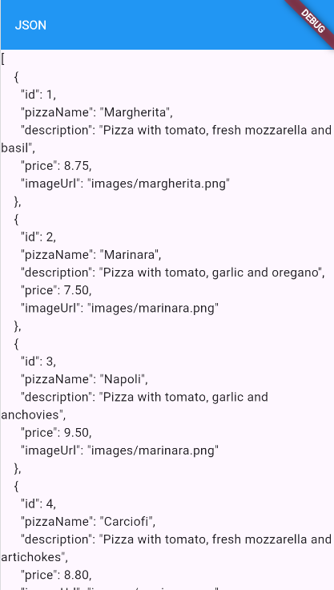
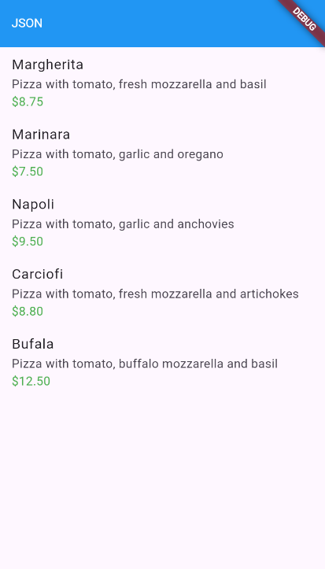

**Laporan Praktikum**
# **Pertemuan 13**
### **Persistensi Data**
------

### **Data Mahasiswa**

><p>Nama : Fanesabhirawaning Sulistyo<p>
>NIM : 2241720027<p>
>Kelas : 3C<p>
>Prodi : D-IV Teknik Informatika<p>
>Jurusan : Teknologi Informasi<p>

<br>

# Praktikum 1:  Converting Dart models into JSON

### Langkah 1
Di editor favorit Anda, buat proyek Flutter baru dan beri nama store_data.

### Langkah 2: 
Pada file main.dart, hapus kode yang ada dan tambahkan kode awal untuk aplikasi dengan kode
berikut:<p>

```dart
import 'package:flutter/material.dart';

void main() {
  runApp(const MyApp());
}

class MyApp extends StatelessWidget {
  const MyApp({super.key});

  // This widget is the root of your application.
  @override
  Widget build(BuildContext context) {
    return MaterialApp(
      title: 'Flutter JSON Demo',
      theme: ThemeData(
        primarySwatch: Colors.blue,
      ),
      home: const MyHomePage(),
    );
  }
}

class MyHomePage extends StatefulWidget {
  const MyHomePage({super.key});

  @override
  State<MyHomePage> createState() => _MyHomePageState();
}

class _MyHomePageState extends State<MyHomePage> {

  @override
  Widget build(BuildContext context) {
    return Scaffold(
      appBar: AppBar(
        title: const Text('250N'),
      ),
      body: Text(pizzaString),
    );
  }
}
```

### Langkah 3: 
Tambahkan folder baru ke root proyek Anda dengan nama assets.

### Langkah 4: 
Di dalam folder aset, buat file baru bernama pizzalist.json dan salin konten yang tersedia di tautan
https://gist.github.com/simoales/a33c1c2abe78b48a75ccfd5fa0de0620. File ini berisi daftar objek
JSON.

### Langkah 5
Di file pubspec.yaml, tambahkan referensi ke folder aset baru, seperti yang ditunjukkan di sini:

```yaml
flutter:
  assets:
    - assets/
```

### Langkah 6: 
Pada kelas _MyHomePageState, di main.dart, tambahkan sebuah variabel state bernama
pizzaString:
```dart
String pizzaString = '';
```

### Langkah 7: 
Untuk membaca isi file pizzalist.json, di bagian bawah kelas _MyHomePageState di main.dart,tambahkan metode asinkron baru yang disebut readJsonFile, yang akan mengatur nilai pizzaString,seperti yang ditunjukkan di sini:


```dart
Future<void> readJsonFile() async {
  String myString = await DefaultAssetBundle.of(context).loadString('assets/pizzalist.json');
  setState(() {
    pizzaString = myString;
  });
}
```

### Langkah 8:
 Pada kelas _MyHomePageState, timpa metode initState dan, di dalamnya, panggil metode
readJsonFile:

```dart
@override
void initState() {
  super.initState();
  readJsonFile();
}
```

### Langkah 9:
Sekarang, kita ingin menampilkan JSON yang diambil di properti dalam S
```dart
Text(pizzaString ),
```

### Langkah 10: 
Mari kita jalankan aplikasinya. Jika semuanya berjalan seperti yang diharapkan, Anda akan
melihat konten file JSON di layar<p>


### Langkah 11: 
Kita ingin mengubah String ini menjadi sebuah List of Objects. Kita akan mulai dengan membuat kelas baru. Dalam folder lib aplikasi kita, buat file baru bernama pizza.dart.<p>

### Langkah 12
Di dalam file tersebut, tentukan properti kelas Pizza:

```dart
class Pizza {
  final int id;
  final String pizzaName;
  final String description;
  final double price;
  final String imageUrl;
}
```

### Langkah 13
Di dalam kelas Pizza, tentukan konstruktor bernama fromJson, yang akan mengambil sebuah Map
sebagai parameter dan mengubah Map menjadi sebuah instance dari Pizza:<p>
```dart
Pizza.fromJson(Map<String, dynamic> json) :
        id = json['id'],
        pizzaName = json['pizzaName'],
        description = json['description'],
        price = json['price'],
        imageUrl = json['imageUrl'];
```
### Langkah 14
Refaktor metode readJsonFile() pada kelas _MyHomePageState. Langkah pertama adalah
mengubah String menjadi Map dengan memanggil metode jsonDecode. Pada method readJsonFile,
tambahkan kode yang di cetak tebal berikut ini:<p>
```dart
Future readJsonnFile() async {
String myString = await DefaultAssetBundle.of(context)
.loadString('assets/pizzalist.json');
List pizzaMapList = jsonDecode(myString);
}
```

### Langkah 15
Pastikan editor Anda secara otomatis menambahkan pernyataan impor untuk pustaka
"dart:convert" di bagian atas file main.dart; jika tidak, tambahkan saja secara manual. Tambahkan juga pernyataan impor untuk kelas pizza:<p>
```dart
import 'dart:convert';
import './pizza.dart';
```

### Langkah 16
Langkah terakhir adalah mengonversi string JSON kita menjadi List of native Dart objects. Kita
dapat melakukan ini dengan mengulang pizzaMapList dan mengubahnya menjadi objek Pizza. Di
dalam metode readJsonFile, di bawah metode jsonDecode, tambahkan kode berikut:<p>
```dart
List<Pizza> myPizzas = [];
    for (var pizza in pizzaMapList) {
      Pizza myPizza = Pizza.fromJson(pizza);
      myPizzas.add(myPizza);
    }
```

### Langkah 17
Hapus atau beri komentar pada metode setState yang mengatur String pizzaString dan
kembalikan daftar objek Pizza sebagai gantinya:<p>
```dart
return myPizzas;
```

### Langkah 18
Ubah signature metode sehingga Anda dapat menampilkan nilai balik secara eksplisit:<p>
```dart
  Future<List<Pizza>> readJsonFile() async {}
```
### Langkah 19
Sekarang kita memiliki objek List of Pizza. Daripada hanya menampilkan sebuah Teks kepada
pengguna, kita dapat menampilkan sebuah ListView yang berisi sekumpulan widget ListTile. Di
bagian atas kelas _MyHomePageState, buat List<Pizza> bernama myPizzas:<p>
```dart
List<Pizza> myPizzas = [];
```

### Langkah 20
 Dalam metode initState, pastikan Anda mengatur myPizzas dengan hasil panggilan ke
readJsonFile:<p>
```dart
@override
void initState() {
  super.initState();
  readJsonFile().then((value) {
    setState(() {
      myPizzas = value; 
    });
  });
}
```
### Langkah 21
Tambahkan kode berikut ini di dalam Scaffold, di dalam metode build():<p>
```dart
body: ListView.builder(
            itemCount: myPizzas.length,
            itemBuilder: (context, index) {
              return ListTile(
                title: Text(myPizzas[index].pizzaName), 
                subtitle: Column(
            crossAxisAlignment: CrossAxisAlignment.start,
            children: [
              Text(myPizzas[index].description), // Display description
              Text(
                '\$${myPizzas[index].price.toStringAsFixed(2)}', // Display price formatted
                style: TextStyle(color: Colors.green), // Optional: Green color for price
              ),
            ],
          ),
              );
            },
          ),
```

### Langkah 22
Jalankan aplikasi. Antarmuka pengguna sekarang seharusnya jauh lebih ramah dan terlihat
seperti yang ditunjukkan pada<p>

