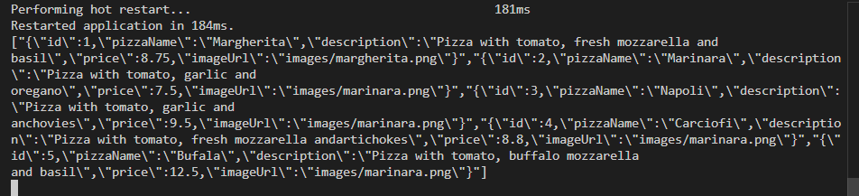
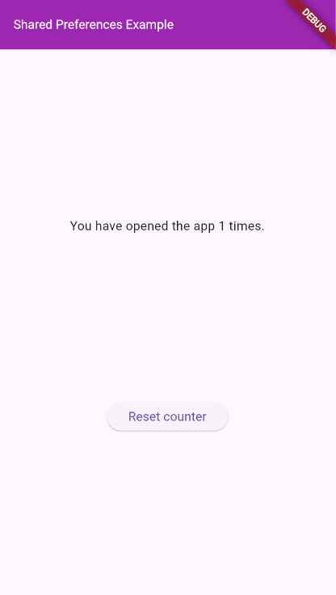
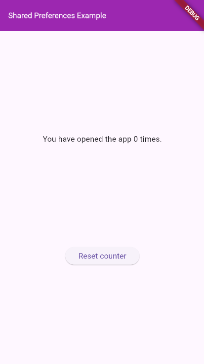
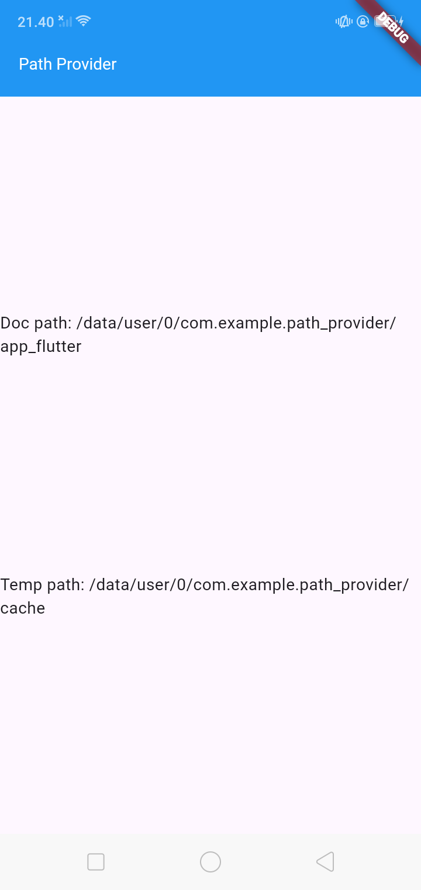
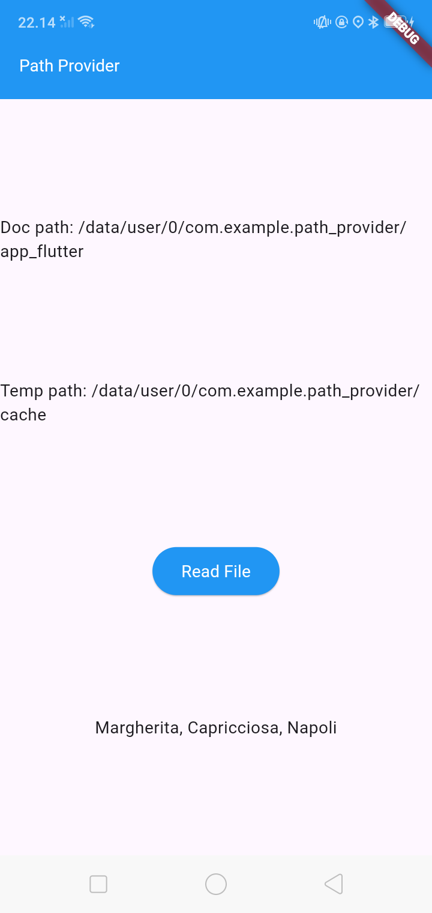
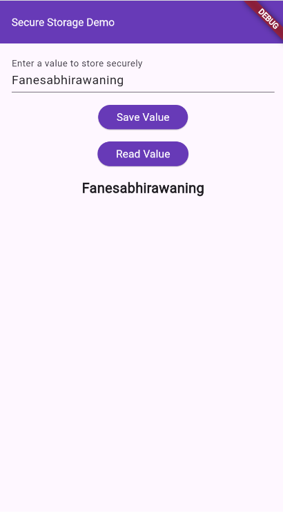

**Laporan Praktikum**
# **Pertemuan 13**
### **Persistensi Data**
------

### **Data Mahasiswa**

><p>Nama : Fanesabhirawaning Sulistyo<p>
>NIM : 2241720027<p>
>Kelas : 3C<p>
>Prodi : D-IV Teknik Informatika<p>
>Jurusan : Teknologi Informasi<p>

<br>

# Praktikum 1:  Converting Dart models into JSON

### Langkah 1  
Di editor favorit Anda, buat proyek Flutter baru dan beri nama `store_data`.

### Langkah 2  
Pada file `main.dart`, hapus kode yang ada dan tambahkan kode awal untuk aplikasi dengan kode berikut:

```dart
import 'package:flutter/material.dart';

void main() {
  runApp(const MyApp());
}

class MyApp extends StatelessWidget {
  const MyApp({super.key});

  @override
  Widget build(BuildContext context) {
    return MaterialApp(
      title: 'Flutter JSON Demo',
      theme: ThemeData(
        primarySwatch: Colors.blue,
      ),
      home: const MyHomePage(),
    );
  }
}

class MyHomePage extends StatefulWidget {
  const MyHomePage({super.key});

  @override
  State<MyHomePage> createState() => _MyHomePageState();
}

class _MyHomePageState extends State<MyHomePage> {

  @override
  Widget build(BuildContext context) {
    return Scaffold(
      appBar: AppBar(
        title: const Text('250N'),
      ),
      body: Text(pizzaString),
    );
  }
}
```

### Langkah 3  
Tambahkan folder baru ke root proyek Anda dengan nama `assets`.

### Langkah 4  
Di dalam folder aset, buat file baru bernama `pizzalist.json` dan salin konten yang tersedia di tautan https://gist.github.com/simoales/a33c1c2abe78b48a75ccfd5fa0de0620. File ini berisi daftar objek JSON.

### Langkah 5  
Di file `pubspec.yaml`, tambahkan referensi ke folder aset baru, seperti yang ditunjukkan di sini:

```yaml
flutter:
  assets:
    - assets/
```

### Langkah 6  
Pada kelas `_MyHomePageState`, di `main.dart`, tambahkan sebuah variabel state bernama `pizzaString`:

```dart
String pizzaString = '';
```

### Langkah 7  
Untuk membaca isi file `pizzalist.json`, di bagian bawah kelas `_MyHomePageState` di `main.dart`, tambahkan metode asinkron baru yang disebut `readJsonFile`, yang akan mengatur nilai `pizzaString`, seperti yang ditunjukkan di sini:

```dart
Future<void> readJsonFile() async {
  String myString = await DefaultAssetBundle.of(context).loadString('assets/pizzalist.json');
  setState(() {
    pizzaString = myString;
  });
}
```

### Langkah 8  
Pada kelas `_MyHomePageState`, timpa metode `initState` dan, di dalamnya, panggil metode `readJsonFile`:

```dart
@override
void initState() {
  super.initState();
  readJsonFile();
}
```

### Langkah 9  
Sekarang, kita ingin menampilkan JSON yang diambil di properti dalam `Text` widget:

```dart
Text(pizzaString),
```

### Langkah 10  
Mari kita jalankan aplikasinya. Jika semuanya berjalan seperti yang diharapkan, Anda akan melihat konten file JSON di layar.<p>


### Langkah 11  
Kita ingin mengubah String ini menjadi sebuah List of Objects. Kita akan mulai dengan membuat kelas baru. Dalam folder `lib` aplikasi kita, buat file baru bernama `pizza.dart`.

### Langkah 12  
Di dalam file tersebut, tentukan properti kelas `Pizza`:

```dart
class Pizza {
  final int id;
  final String pizzaName;
  final String description;
  final double price;
  final String imageUrl;
}
```

### Langkah 13  
Di dalam kelas `Pizza`, tentukan konstruktor bernama `fromJson`, yang akan mengambil sebuah `Map` sebagai parameter dan mengubah `Map` menjadi sebuah instance dari `Pizza`:

```dart
Pizza.fromJson(Map<String, dynamic> json) :
        id = json['id'],
        pizzaName = json['pizzaName'],
        description = json['description'],
        price = json['price'],
        imageUrl = json['imageUrl'];
```

### Langkah 14  
Refaktor metode `readJsonFile()` pada kelas `_MyHomePageState`. Langkah pertama adalah mengubah String menjadi Map dengan memanggil metode `jsonDecode`. Pada metode `readJsonFile`, tambahkan kode berikut ini:

```dart
Future readJsonFile() async {
  String myString = await DefaultAssetBundle.of(context)
    .loadString('assets/pizzalist.json');
  List pizzaMapList = jsonDecode(myString);
}
```

### Langkah 15  
Pastikan editor Anda secara otomatis menambahkan pernyataan impor untuk pustaka `dart:convert` di bagian atas file `main.dart`; jika tidak, tambahkan saja secara manual. Tambahkan juga pernyataan impor untuk kelas `Pizza`:

```dart
import 'dart:convert';
import './pizza.dart';
```

### Langkah 16  
Langkah terakhir adalah mengonversi string JSON kita menjadi List of native Dart objects. Kita dapat melakukan ini dengan mengulang `pizzaMapList` dan mengubahnya menjadi objek `Pizza`. Di dalam metode `readJsonFile`, di bawah metode `jsonDecode`, tambahkan kode berikut:

```dart
List<Pizza> myPizzas = [];
for (var pizza in pizzaMapList) {
  Pizza myPizza = Pizza.fromJson(pizza);
  myPizzas.add(myPizza);
}
```

### Langkah 17  
Hapus atau beri komentar pada metode `setState` yang mengatur String `pizzaString` dan kembalikan daftar objek `Pizza` sebagai gantinya:

```dart
return myPizzas;
```

### Langkah 18  
Ubah signature metode sehingga Anda dapat menampilkan nilai balik secara eksplisit:

```dart
Future<List<Pizza>> readJsonFile() async {}
```

### Langkah 19  
Sekarang kita memiliki objek List of Pizza. Daripada hanya menampilkan sebuah `Text` kepada pengguna, kita dapat menampilkan sebuah `ListView` yang berisi sekumpulan widget `ListTile`. Di bagian atas kelas `_MyHomePageState`, buat `List<Pizza>` bernama `myPizzas`:

```dart
List<Pizza> myPizzas = [];
```

### Langkah 20  
Dalam metode `initState`, pastikan Anda mengatur `myPizzas` dengan hasil panggilan ke `readJsonFile`:

```dart
@override
void initState() {
  super.initState();
  readJsonFile().then((value) {
    setState(() {
      myPizzas = value; 
    });
  });
}
```

### Langkah 21  
Tambahkan kode berikut ini di dalam `Scaffold`, di dalam metode `build()`:

```dart
body: ListView.builder(
  itemCount: myPizzas.length,
  itemBuilder: (context, index) {
    return ListTile(
      title: Text(myPizzas[index].pizzaName), 
      subtitle: Column(
        crossAxisAlignment: CrossAxisAlignment.start,
        children: [
          Text(myPizzas[index].description),
          Text(
            '\$${myPizzas[index].price.toStringAsFixed(2)}',
            style: TextStyle(color: Colors.green),
          ),
        ],
      ),
    );
  },
),
```

### Langkah 22  
Jalankan aplikasi. Antarmuka pengguna sekarang seharusnya jauh lebih ramah dan terlihat seperti yang ditunjukkan pada gambar.<p>


# Praktikum 2 : Reading the JSON File

### Langkah 1
Tambahkan metode baru ke kelas Pizza, di file pizza.dart, yang disebut `toJson`. Ini akan mengembalikan sebuah Map<String, dynamic> dari objek:

```dart
Map<String, dynamic> toJson() {
  return {
    'id': id,
    'pizzaName': pizzaName,
    'description': description,
    'price': price,
    'imageUrl': imageUrl,
  };
}
```

### Langkah 2
Setelah Anda memiliki sebuah Map, Anda dapat menserialisasikannya kembali ke dalam string JSON. Tambahkan metode baru di bagian bawah kelas `_MyHomePageState`, di dalam file main.dart, yang disebut `convertToJSON`:

```dart
String convertToJSON(List<Pizza> pizzas) {
  return jsonEncode(pizzas.map((pizza) => jsonEncode(pizza)).toList());
}
```

### Langkah 3
Metode ini mengubah objek List of Pizza kembali menjadi string JSON dengan memanggil metode `jsonEncode` lagi di pustaka `dart:convert`.

### Langkah 4
Terakhir, mari panggil metode tersebut dan cetak string JSON di Debug Console. Tambahkan kode berikut ke metode `readJsonFile`, tepat sebelum mengembalikan `List myPizzas`:

```dart
String json = convertToJSON(myPizzas);
print(json);
return myPizzas;
```

### Langkah 5
Jalankan aplikasi. Anda akan melihat string JSON dicetak, seperti yang ditunjukkan pada gambar berikut: (output JSON dicetak di konsol Debug).


#  Praktikum 3: Saving data simply with SharedPreferences

### Langkah 1  
Gunakan project pada pertemuan 11 bernama `books`. Pertama, tambahkan ketergantungan pada `shared_preferences`. Dari Terminal Anda, ketikkan perintah berikut:  
```bash
flutter pub add shared_preferences
```

### Langkah 2  
Untuk memperbarui dependensi dalam proyek Anda, jalankan perintah `flutter pub get` dari jendela Terminal.

### Langkah 3  
Di bagian atas file `main.dart`, impor `shared_preferences`:
```dart
import 'package:shared_preferences/shared_preferences.dart';
```

### Langkah 4  
Di bagian atas kelas `_MyHomePageState`, buat variabel status integer baru bernama `appCounter`:
```dart
int appCounter = 0;
```

### Langkah 5  
Dalam kelas `_MyHomePageState`, buat metode asinkron baru yang disebut `readAndWritePreferences()`:
```dart
Future readAndWritePreference() async {}
```

### Langkah 6  
Di dalam metode `readAndWritePreference`, buatlah sebuah instance dari `SharedPreferences`:
```dart
SharedPreferences prefs = await SharedPreferences.getInstance();
```

### Langkah 7  
Setelah membuat instance preferensi, kita membuat kode yang mencoba baca nilai kunci `appCounter`. Jika nilainya nol, setel ke 0; lalu naikkan nilainya:
```dart
appCounter = prefs.getInt('appCounter') ?? 0;
appCounter++;
```

### Langkah 8  
Setelah itu, atur nilai kunci `appCounter` di preferensi ke nilai baru:
```dart
await prefs.setInt('appCounter', appCounter);
```

### Langkah 9  
Memperbarui nilai status `appCounter`:
```dart
setState(() {
  appCounter = appCounter;
});
```

### Langkah 10  
Pada metode `initState` di kelas `_MyHomePageState`, panggil metode `readAndWritePreference` dengan kode berikut:
```dart
@override
void initState() {
  super.initState();
  readAndWritePreference();
}
```

### Langkah 11  
Dalam metode `build`, tambahkan kode berikut ini di dalam widget `Container`:
```dart
child: Center(
  child: Column(
    mainAxisAlignment: MainAxisAlignment.spaceEvenly,
    children: [
      Text('You have opened the app $appCounter times.'),
      ElevatedButton(
        onPressed: () {},
        child: Text('Reset counter'),
      ),
    ],
  ),
)
```

### Langkah 12  
Jalankan aplikasi. Saat pertama kali membukanya, Anda akan melihat layar yang mirip dengan yang berikut ini:<p>


### Langkah 13  
Tambahkan metode baru ke kelas `_MyHomePageState` yang disebut `deletePreference()`, yang akan menghapus nilai yang disimpan:
```dart
Future deletePreference() async {
  SharedPreferences prefs = await SharedPreferences.getInstance();
  await prefs.clear();
  setState(() {
    appCounter = 0;
  });
}
```

### Langkah 14  
Dari properti `onPressed` dari widget `ElevatedButton` di metode `build()`, panggil metode `deletePreference()`, dengan kode berikut:
```dart
ElevatedButton(
  onPressed: () {
    deletePreference();
  },
  child: Text('Reset counter'),
)
```

### Langkah 15  
Jalankan aplikasi lagi. Sekarang, saat Anda menekan tombol `Reset counter`, nilai `appCounter` akan dihapus.<p>



# Praktikum 4: Accessing the filesystem, part 1: path_provider

### Langkah 1  
Buatlah project flutter baru dengan nama `path_provider`.

### Langkah 2  
Menambahkan dependency yang relevan ke file `pubspec.yaml`. Tambahkan `path_provider` dengan mengetikkan perintah ini dari Terminal Anda:
```bash
flutter pub add path_provider
```

### Langkah 3  
Di bagian atas file `main.dart`, tambahkan impor `path_provider`:
```dart
import 'package:path_provider/path_provider.dart';
```

### Langkah 4  
Di bagian atas kelas `_MyHomePageState`, tambahkan variabel State yang akan kita gunakan untuk memperbarui antarmuka pengguna:
```dart
String documentsPath = '';
String tempPath = '';
```
### Langkah 5  
Masih dalam kelas `_MyHomePageState`, tambahkan metode untuk mengambil direktori temporary dan dokumen:
```dart
Future getPaths() async {
  final docDir = await getApplicationDocumentsDirectory();
  final tempDir = await getTemporaryDirectory();
  setState(() {
    documentsPath = docDir.path;
    tempPath = tempDir.path;
  });
}
```

### Langkah 6  
Pada metode `initState` dari kelas `_MyHomePageState`, panggil metode `getPaths`:
```dart
@override
void initState() {
  super.initState();
  getPaths();
}
```

### Langkah 7  
Pada metode `build` dari `_MyHomePageState`, buat UI dengan dua widget `Text` yang menunjukkan path yang diambil:
```dart
@override
Widget build(BuildContext context) {
  return Scaffold(
    appBar: AppBar(title: const Text('Path Provider')),
    body: Column(
      mainAxisAlignment: MainAxisAlignment.spaceEvenly,
      children: [
        Text('Doc path: $documentsPath'),
        Text('Temp path: $tempPath'),
      ],
    ),
  );
}
```

### Langkah 8  
Jalankan aplikasi. Anda akan melihat layar yang terlihat seperti berikut ini: (output dengan path dokumen dan temporary yang ditampilkan pada UI).<p>



 # Praktikum 5: Accessing the filesystem, part 2: Working with directories

### Langkah 1  
Di bagian atas berkas `main.dart`, impor pustaka `dart:io`:  
```dart
import 'dart:io';
```

### Langkah 2  
Di bagian atas kelas `_MyHomePageState`, di file `main.dart`, buat dua variabel State baru untuk file dan isinya:  
```dart
late File myFile;
String fileText = '';
```

### Langkah 3  
Masih dalam kelas `_MyHomePageState`, buat metode baru bernama `writeFile` dan gunakan kelas `File` dari pustaka `dart:io` untuk membuat file baru:  
```dart
Future<bool> writeFile() async {
  try {
    await myFile.writeAsString('Margherita, Capricciosa, Napoli');
    return true;
  } catch (e) {
    return false;
  }
}
```

### Langkah 4  
Dalam metode `initState`, setelah memanggil metode `getPaths`, dalam metode `then`, buat sebuah file dan panggil metode `writeFile`:  
```dart
@override
void initState() {
  getPaths().then(() {
    myFile = File('$documentsPath/pizzas.txt');
    writeFile();
  });
  super.initState();
}
```

### Langkah 5  
Buat metode untuk membaca file:  
```dart
Future<bool> readFile() async {
  try {
    // Read the file.
    String fileContent = await myFile.readAsString();
    setState(() {
      fileText = fileContent;
    });
    return true;
  } catch (e) {
    // On error, return false.
    return false;
  }
}
```

### Langkah 6  
Dalam metode `build`, di widget `Column`, perbarui antarmuka pengguna dengan `ElevatedButton`. Ketika pengguna menekan tombol, tombol akan mencoba membaca konten file dan menampilkannya di layar:  
```dart
children: [
  Text('Doc path: $documentsPath'),
  Text('Temp path: $tempPath'),
  ElevatedButton(
    child: const Text('Read File'),
    onPressed: () => readFile(),
  ),
  Text(fileText),
],
```

### Langkah 7  
Jalankan aplikasi dan tekan tombol **Baca File**. Di bawah tombol tersebut, Anda akan melihat teks:  
**Margherita, Capricciosa, Napoli**, seperti yang ditunjukkan pada tangkapan layar. 



# Praktikum 6: Using secure storage to store data

### Langkah 1  
Tambahkan **flutter_secure_storage** ke proyek Anda dengan mengetik perintah:  
`flutter pub add flutter_secure_storage`  

### Langkah 2  
Di file `main.dart`, salin kode berikut:  
```dart
import 'package:flutter/material.dart';

void main() {
  runApp(const MyApp());
}

class MyApp extends StatelessWidget {
  const MyApp({super.key});

  @override
  Widget build(BuildContext context) {
    return MaterialApp(
      title: 'Flutter Demo',
      theme: ThemeData(
        primarySwatch: Colors.deepPurple,
      ),
      home: const MyHomePage(),
    );
  }
}

class MyHomePage extends StatefulWidget {
  const MyHomePage({super.key});

  @override
  State<MyHomePage> createState() => _MyHomePageState();
}

class _MyHomePageState extends State<MyHomePage> {
  final pwdController = TextEditingController();
  String myPass = "";

  @override
  void initState() {
    super.initState();
  }

  @override
  Widget build(BuildContext context) {
    return Scaffold(
      appBar: AppBar(title: const Text('Secure Storage')),
      body: SingleChildScrollView(
        child: Padding(
          padding: const EdgeInsets.all(16.0),
          child: Column(
            children: [
              TextField(
                controller: pwdController,
              ),
              ElevatedButton(
                child: const Text('Save Value'),
                onPressed: () {}, // Placeholder
              ),
              ElevatedButton(
                child: const Text('Read Value'),
                onPressed: () {}, // Placeholder
              ),
              Text(myPass),
            ],
          ),
        ),
      ),
    );
  }
}
```

### Langkah 3  
Tambahkan impor berikut di bagian atas file `main.dart`:  
```dart
import 'package:flutter_secure_storage/flutter_secure_storage.dart';
```

### Langkah 4  
Di bagian atas kelas `_MyHomePageState`, buat penyimpanan aman:  
```dart
final storage = const FlutterSecureStorage();
final myKey = 'myPass';
```

### Langkah 5  
Tambahkan metode untuk menulis data ke penyimpanan aman:  
```dart
Future<void> writeToSecureStorage() async {
  await storage.write(key: myKey, value: pwdController.text);
}
```

### Langkah 6  
Tambahkan kode di dalam **tombol Save Value** untuk menulis ke penyimpanan:  
```dart
ElevatedButton(
  child: const Text('Save Value'),
  onPressed: () {
    writeToSecureStorage();
  },
),
```

### Langkah 7  
Tambahkan metode untuk membaca data dari penyimpanan aman:  
```dart
Future<String> readFromSecureStorage() async {
  String secret = await storage.read(key: myKey) ?? '';
  return secret;
}
```

### Langkah 8  
Tambahkan kode di dalam **tombol Read Value** untuk membaca dari penyimpanan dan memperbarui variabel `myPass`:  
```dart
ElevatedButton(
  child: const Text('Read Value'),
  onPressed: () {
    readFromSecureStorage().then((value) {
      setState(() {
        myPass = value;
      });
    });
  },
),
```

### Langkah 9  
Jalankan aplikasi. Ketik beberapa teks di bidang teks, tekan tombol **Save Value**, lalu tekan tombol **Read Value** untuk melihat teks yang Anda simpan.<p>

