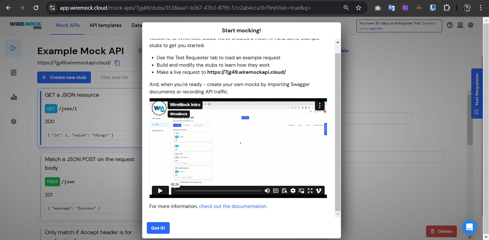
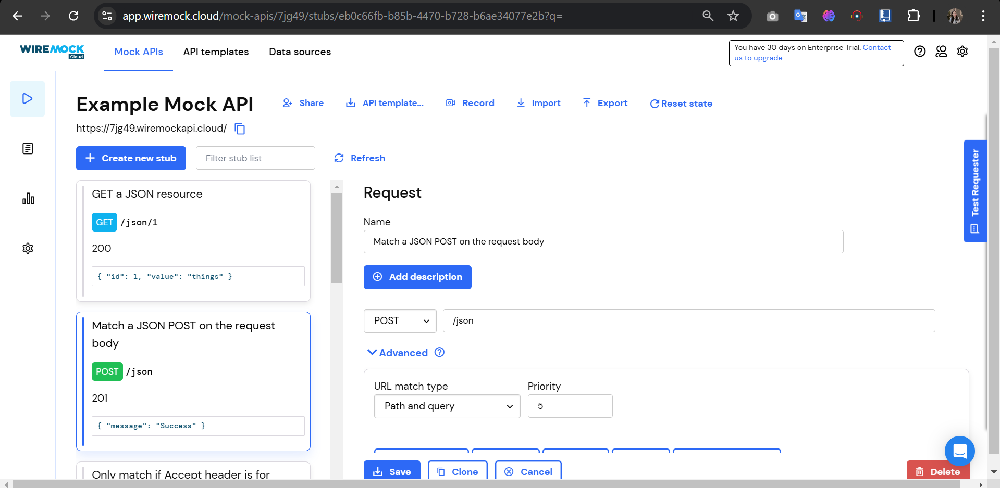
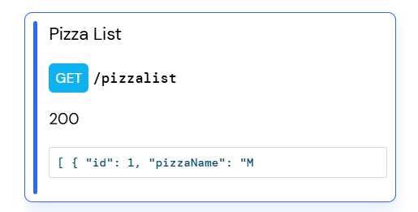
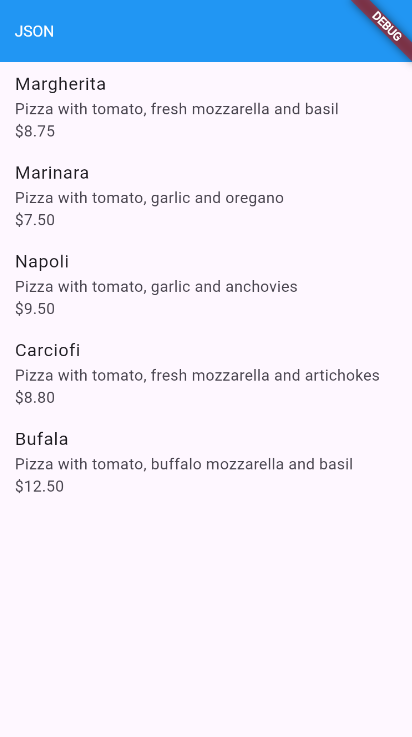

### **Restful API**
------

### **Data Mahasiswa**

><p>Nama : Fanesabhirawaning Sulistyo<p>
>NIM : 2241720027<p>
>Kelas : 3C<p>
>Prodi : D-IV Teknik Informatika<p>
>Jurusan : Teknologi Informasi<p>

<br>

# Praktikum 1, Designing an HTTP client and getting data
Sebagian besar aplikasi seluler mengandalkan data yang berasal dari sumber eksternal. 
Pikirkan aplikasi untuk membaca buku, menonton film, berbagi gambar dengan teman, 
membaca berita, atau menulis email: semua aplikasi ini menggunakan data yang diambil dari 
sumber eksternal. Ketika sebuah aplikasi menggunakan data eksternal, biasanya, ada layanan 
backend yang menyediakan data tersebut untuk aplikasi: layanan web atau API web. Yang 
terjadi adalah aplikasi Anda (frontend atau klien) terhubung ke layanan web melalui HTTP dan 
meminta sejumlah data. Layanan backend kemudian merespons dengan mengirimkan data ke 
aplikasi, biasanya dalam format JSON atau XML.<p>
Untuk praktikum kali ini, kita akan membuat aplikasi yang membaca dan menulis data dari 
layanan web. Karena membuat API web berada di luar cakupan buku ini, kita akan 
menggunakan layanan yang tersedia, yang disebut Wire Mock Cloud, yang akan 
mensimulasikan perilaku layanan web yang sebenarnya, tetapi akan sangat mudah disiapkan 
dan digunakan.<p>

### Langkah 1  
Mendaftarlah ke layanan Lab Mock di [https://app.wiremock.cloud/](https://app.wiremock.cloud/). Anda bisa menggunakan akun Google untuk mendaftar. Jika berhasil mendaftar dan login, maka akan muncul dashboard awal. <p>
 

### Langkah 2  
Di halaman dashboard, klik menu **Stubs**, kemudian klik entri pertama yaitu **“GET a JSON resource”**. Anda akan melihat layar yang menampilkan detail stub tersebut.<p>



### Langkah 3  
Klik tombol **“Create new stub”**. Di kolom sebelah kanan, lengkapi data berikut:  
- Nama: **“Pizza List”**  
- Pilih metode **GET**  
- Isi path dengan **“/pizzalist”**  
Pada bagian **Response**, atur:  
- Status: **200**  
- Body: pilih format **JSON**  
- Salin dan tempel konten JSON dari [https://bit.ly/pizzalist](https://bit.ly/pizzalist) <p>

  

### Langkah 4  
Tekan tombol **SAVE** di bagian bawah halaman untuk menyimpan stub. Jika berhasil, maka Mock API Anda siap digunakan.  


### Langkah 5  
Buatlah project Flutter baru dengan nama **pizza_api_nama_anda**. Tambahkan dependency **http** melalui terminal dengan perintah berikut:  
```bash
flutter pub add http
```

### Langkah 6  
Di folder **lib** dalam project Anda, tambahkan file baru dengan nama **httphelper.dart**.  

### Langkah 7  
Isi file **httphelper.dart** dengan kode berikut. Ubah `"02z2g.mocklab.io"` dengan URL Mock API Anda:  
```dart
import 'dart:io';
import 'package:http/http.dart' as http;
import 'dart:convert';
import 'package:pizza_api_fanesa/pizza.dart';

class HttpHelper {
  final String authority = '7jg49.wiremockapi.cloud'; // Ganti dengan URL Mock API Anda
  final String path = 'pizzalist';

  Future<List<Pizza>> getPizzaList() async {
    final Uri url = Uri.https(authority, path);
    final http.Response result = await http.get(url);
    if (result.statusCode == HttpStatus.ok) {
      final jsonResponse = json.decode(result.body);
      List<Pizza> pizzas =
          jsonResponse.map<Pizza>((i) => Pizza.fromJson(i)).toList();
      return pizzas;
    } else {
      return [];
    }
  }
}
```

### Langkah 8  
Di file **main.dart**, pada class **MyHomePageState**, tambahkan metode bernama **callPizzas**. Metode ini akan mengembalikan sebuah **Future** dari daftar objek **Pizza** dengan memanggil metode **getPizzaList** dari kelas **HttpHelper**. Tambahkan kode berikut:  
```dart
Future<List<Pizza>> callPizzas() async {
  HttpHelper helper = HttpHelper();
  List<Pizza> pizzas = await helper.getPizzaList();
  return pizzas;
}
```

### Langkah 9  
Pada metode **build** di class **MyHomePageState**, di dalam body **Scaffold**, tambahkan **FutureBuilder** untuk membuat **ListView** yang berisi widget **ListTile** dengan data objek **Pizza**:  
```dart
Widget build(BuildContext context) {
  return Scaffold(
    appBar: AppBar(title: const Text('JSON')),
    body: FutureBuilder(
      future: callPizzas(),
      builder: (BuildContext context, AsyncSnapshot<List<Pizza>> snapshot) {
        if (snapshot.hasError) {
          return const Text('Something went wrong');
        }
        if (!snapshot.hasData) {
          return const CircularProgressIndicator();
        }
        return ListView.builder(
          itemCount: snapshot.data!.length,
          itemBuilder: (BuildContext context, int position) {
            return ListTile(
              title: Text(snapshot.data![position].pizzaName),
              subtitle: Text(snapshot.data![position].description +
                  snapshot.data![position].price.toString()),
            );
          },
        );
      },
    ),
  );
}
```

### Langkah 10  
Jalankan aplikasi Flutter Anda untuk melihat daftar pizza yang ditampilkan menggunakan data dari Mock API.<p>
