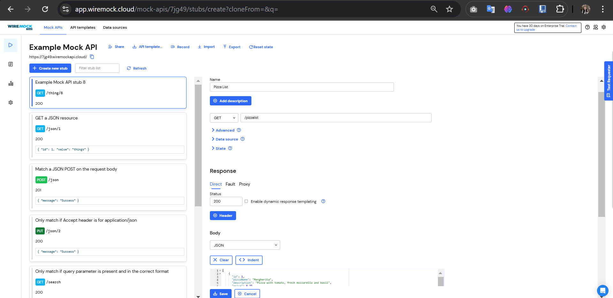

### **Restful API**
------

### **Data Mahasiswa**

><p>Nama : Fanesabhirawaning Sulistyo<p>
>NIM : 2241720027<p>
>Kelas : 3C<p>
>Prodi : D-IV Teknik Informatika<p>
>Jurusan : Teknologi Informasi<p>

<br>

# Praktikum 1, Designing an HTTP client and getting data
Sebagian besar aplikasi seluler mengandalkan data yang berasal dari sumber eksternal. 
Pikirkan aplikasi untuk membaca buku, menonton film, berbagi gambar dengan teman, 
membaca berita, atau menulis email: semua aplikasi ini menggunakan data yang diambil dari 
sumber eksternal. Ketika sebuah aplikasi menggunakan data eksternal, biasanya, ada layanan 
backend yang menyediakan data tersebut untuk aplikasi: layanan web atau API web. Yang 
terjadi adalah aplikasi Anda (frontend atau klien) terhubung ke layanan web melalui HTTP dan 
meminta sejumlah data. Layanan backend kemudian merespons dengan mengirimkan data ke 
aplikasi, biasanya dalam format JSON atau XML.<p>
Untuk praktikum kali ini, kita akan membuat aplikasi yang membaca dan menulis data dari 
layanan web. Karena membuat API web berada di luar cakupan buku ini, kita akan 
menggunakan layanan yang tersedia, yang disebut Wire Mock Cloud, yang akan 
mensimulasikan perilaku layanan web yang sebenarnya, tetapi akan sangat mudah disiapkan 
dan digunakan.<p>

### Langkah 1  
Mendaftarlah ke layanan Lab Mock di [https://app.wiremock.cloud/](https://app.wiremock.cloud/). Anda bisa menggunakan akun Google untuk mendaftar. Jika berhasil mendaftar dan login, maka akan muncul dashboard awal. <p>
 

### Langkah 2  
Di halaman dashboard, klik menu **Stubs**, kemudian klik entri pertama yaitu **“GET a JSON resource”**. Anda akan melihat layar yang menampilkan detail stub tersebut.<p>


### Langkah 3  
Klik tombol **“Create new stub”**. Di kolom sebelah kanan, lengkapi data berikut:  
- Nama: **“Pizza List”**  
- Pilih metode **GET**  
- Isi path dengan **“/pizzalist”**  
Pada bagian **Response**, atur:  
- Status: **200**  
- Body: pilih format **JSON**  
- Salin dan tempel konten JSON dari [https://bit.ly/pizzalist](https://bit.ly/pizzalist) <p>

  

### Langkah 4  
Tekan tombol **SAVE** di bagian bawah halaman untuk menyimpan stub. Jika berhasil, maka Mock API Anda siap digunakan.  


### Langkah 5  
Buatlah project Flutter baru dengan nama **pizza_api_nama_anda**. Tambahkan dependency **http** melalui terminal dengan perintah berikut:  
```bash
flutter pub add http
```

### Langkah 6  
Di folder **lib** dalam project Anda, tambahkan file baru dengan nama **httphelper.dart**.  

### Langkah 7  
Isi file **httphelper.dart** dengan kode berikut. Ubah `"02z2g.mocklab.io"` dengan URL Mock API Anda:  
```dart
import 'dart:io';
import 'package:http/http.dart' as http;
import 'dart:convert';
import 'package:pizza_api_fanesa/pizza.dart';

class HttpHelper {
  final String authority = '7jg49.wiremockapi.cloud'; // Ganti dengan URL Mock API Anda
  final String path = 'pizzalist';

  Future<List<Pizza>> getPizzaList() async {
    final Uri url = Uri.https(authority, path);
    final http.Response result = await http.get(url);
    if (result.statusCode == HttpStatus.ok) {
      final jsonResponse = json.decode(result.body);
      List<Pizza> pizzas =
          jsonResponse.map<Pizza>((i) => Pizza.fromJson(i)).toList();
      return pizzas;
    } else {
      return [];
    }
  }
}
```

### Langkah 8  
Di file **main.dart**, pada class **MyHomePageState**, tambahkan metode bernama **callPizzas**. Metode ini akan mengembalikan sebuah **Future** dari daftar objek **Pizza** dengan memanggil metode **getPizzaList** dari kelas **HttpHelper**. Tambahkan kode berikut:  
```dart
Future<List<Pizza>> callPizzas() async {
  HttpHelper helper = HttpHelper();
  List<Pizza> pizzas = await helper.getPizzaList();
  return pizzas;
}
```

### Langkah 9  
Pada metode **build** di class **MyHomePageState**, di dalam body **Scaffold**, tambahkan **FutureBuilder** untuk membuat **ListView** yang berisi widget **ListTile** dengan data objek **Pizza**:  
```dart
Widget build(BuildContext context) {
  return Scaffold(
    appBar: AppBar(title: const Text('JSON')),
    body: FutureBuilder(
      future: callPizzas(),
      builder: (BuildContext context, AsyncSnapshot<List<Pizza>> snapshot) {
        if (snapshot.hasError) {
          return const Text('Something went wrong');
        }
        if (!snapshot.hasData) {
          return const CircularProgressIndicator();
        }
        return ListView.builder(
          itemCount: snapshot.data!.length,
          itemBuilder: (BuildContext context, int position) {
            return ListTile(
              title: Text(snapshot.data![position].pizzaName),
              subtitle: Text(snapshot.data![position].description +
                  snapshot.data![position].price.toString()),
            );
          },
        );
      },
    ),
  );
}
```

### Langkah 10  
Jalankan aplikasi Flutter Anda untuk melihat daftar pizza yang ditampilkan menggunakan data dari Mock API.<p>


<br>

# Praktikum 2. POST-ing data
Dalam praktikum ini, Anda akan mempelajari cara melakukan tindakan POST pada layanan 
web. Hal ini berguna ketika Anda menyambungkan ke layanan web yang tidak hanya 
menyediakan data, tetapi juga memungkinkan Anda untuk mengubah informasi yang 
tersimpan di sisi server. Biasanya, Anda harus menyediakan beberapa bentuk autentikasi ke 
layanan, tetapi untuk praktikum ini, karena kita menggunakan layanan Mock API, hal ini tidak 
diperlukan.<p>

### Langkah 1  
Masuk ke layanan Lab Mock di https://app.wiremock.cloud/ dan klik bagian Stubs, kemudian, buatlah stub baru.  

### Langkah 2  
Lengkapi isian seperti gambar berikut.<p>


### Langkah 3  
Simpan. <p>


### Langkah 4  
Di proyek Flutter, di file httpHelper.dart, di kelas HttpHelper, buat metode baru bernama `postPizza`, lengkapi kode sebagai berikut:  
```dart
Future<String> postPizza(Pizza pizza) async {
  const postPath = '/pizza';
  String post = json.encode(pizza.toJson());
  Uri url = Uri.https(authority, postPath);
  http.Response r = await http.post(url, body: post);
  return r.body;
}
```

### Langkah 5  
Di dalam proyek, buat sebuah file baru bernama `pizza_detail.dart`.  

### Langkah 6  
Di bagian atas file baru, tambahkan impor yang diperlukan.  
```dart
import 'package:flutter/material.dart';
import 'pizza.dart';
import 'httphelper.dart';
```

### Langkah 7  
Buat Stateful Widget bernama `PizzaDetailScreen`.  
```dart
class PizzaDetailScreen extends StatefulWidget {
  const PizzaDetailScreen({super.key});
  @override
  State<PizzaDetailScreen> createState() => PizzaDetailScreenState();
}
```

### Langkah 8  
Di bagian atas kelas `PizzaDetailScreenState`, tambahkan lima widget `TextEditingController`. Widget ini akan berisi data untuk objek Pizza yang akan diposting nanti. Juga, tambahkan sebuah String yang akan berisi hasil dari permintaan POST.  
```dart
final TextEditingController txtId = TextEditingController();
final TextEditingController txtName = TextEditingController();
final TextEditingController txtDescription = TextEditingController();
final TextEditingController txtPrice = TextEditingController();
final TextEditingController txtImageUrl = TextEditingController();
String operationResult = '';
```

### Langkah 9  
Override metode `dispose()` untuk membuang controllers.  
```dart
@override
void dispose() {
  txtId.dispose();
  txtName.dispose();
  txtDescription.dispose();
  txtPrice.dispose();
  txtImageUrl.dispose();
  super.dispose();
}
```

### Langkah 10  
Dalam metode `build()` pada kelas, kita return sebuah Scaffold, yang AppBar-nya berisi Teks yang menyatakan "Detail Pizza" dan Body-nya berisi Padding dan `SingleChildScrollView` yang berisi Column.  
```dart
return Scaffold(
  appBar: AppBar(
    title: const Text('Pizza Detail'),
  ),
  body: Padding(
    padding: const EdgeInsets.all(12),
    child: SingleChildScrollView(
      child: Column(children: []),
    ),
  ),
);
```

### Langkah 11  
Untuk properti anak dari Column, tambahkan beberapa `Text` yang akan berisi hasil posting, lima `TextFields`, masing-masing terikat pada `TextEditingController`, dan sebuah `ElevatedButton` untuk menyelesaikan aksi POST (metode `postPizza` akan dibuat berikutnya). Juga, tambahkan `SizedBox` untuk memberi jarak pada widget di layar.  
```dart
Text(
  operationResult,
  style: TextStyle(
    Colors.green[200],
    backgroundColor: Colors.black,
  ),
),
const SizedBox(height: 24),
TextField(
  controller: txtId,
  decoration: const InputDecoration(hintText: 'Insert ID'),
),
const SizedBox(height: 24),
TextField(
  controller: txtName,
  decoration: const InputDecoration(hintText: 'Insert Pizza Name'),
),
const SizedBox(height: 24),
TextField(
  controller: txtDescription,
  decoration: const InputDecoration(hintText: 'Insert Description'),
),
const SizedBox(height: 24),
TextField(
  controller: txtPrice,
  decoration: const InputDecoration(hintText: 'Insert Price'),
),
const SizedBox(height: 24),
TextField(
  controller: txtImageUrl,
  decoration: const InputDecoration(hintText: 'Insert Image Url'),
),
const SizedBox(height: 48),
ElevatedButton(
  child: const Text('Send Post'),
  onPressed: () {
    postPizza();
  },
)
```

### Langkah 12  
Di bagian bawah kelas `PizzaDetailState`, tambahkan metode `postPizza`.  
```dart
Future postPizza() async {
  HttpHelper helper = HttpHelper();
  
  // Membuat objek Pizza dengan memberikan semua parameter yang dibutuhkan
  Pizza pizza = Pizza(
    id: int.tryParse(txtId.text) ?? 0,  // Memberikan nilai default 0 jika ID tidak valid
    pizzaName: txtName.text,            // Nama pizza dari input pengguna
    description: txtDescription.text,   // Deskripsi pizza dari input pengguna
    price: double.tryParse(txtPrice.text) ?? 0.0,  // Memberikan nilai default 0.0 jika harga tidak valid
    imageUrl: txtImageUrl.text,         // URL gambar pizza dari input pengguna
  );

  String result = await helper.postPizza(pizza);  // Mengirimkan data pizza ke server
  setState(() {
    operationResult = result;  // Menyimpan hasil dari permintaan POST
  });
}
```

### Langkah 13  
Di file `main.dart`, impor file `pizza_detail.dart`.  

### Langkah 14  
Di dalam metode `build()` dari kelas `MyHomePageState`, tambahkan `FloatingActionButton` yang akan menavigasi ke rute `PizzaDetail`.  
```dart
floatingActionButton: FloatingActionButton(
  child: const Icon(Icons.add),
  onPressed: () {
    Navigator.push(
      context,
      MaterialPageRoute(builder: (context) => const PizzaDetailScreen()),
    );
  },
),
```

### Langkah 15  
Jalankan aplikasi. Pada layar utama, tekan `FloatingActionButton` untuk menavigasi ke rute `PizzaDetail`.

### Langkah 16  
Tambahkan detail pizza di kolom teks dan tekan tombol Kirim Postingan. Anda akan melihat hasil yang berhasil, seperti yang ditunjukkan pada gambar berikut.<p>


<br><br>

# Praktikum 3, PUT-ting data

### Langkah 1
Masuk ke layanan Lab Mock di https://app.wiremock.cloud/ dan klik bagian Stubs, kemudian, buatlah stub baru.<p>

### Langkah 2
Lengkapi isian seperti gambar berikut:<p>


### Langkah 3
Simpan stub yang telah dibuat.<p>


### Langkah 4
Di proyek Flutter, tambahkan metode `putPizza` ke kelas `HttpHelper` di file `http_helper.dart`:

```dart
Future<String> putPizza(Pizza pizza) async {
  const putPath = '/pizza';
  String put = json.encode(pizza.toJson());
  Uri url = Uri.https('your-api-domain', putPath);
  http.Response r = await http.put(url, body: put);
  return r.body;
}
```

### Langkah 5
Di kelas `PizzaDetailScreen` di file `pizza_detail.dart`, tambahkan dua properti: `Pizza` dan `boolean`. Di konstruktor, atur kedua properti tersebut:

```dart
final Pizza pizza;
final bool isNew;
const PizzaDetailScreen({super.key, required this.pizza, required this.isNew});
```

### Langkah 6
Di kelas `PizzaDetailScreenState`, override metode `initState`. Bila properti `isNew` dari kelas `PizzaDetail` tidak baru, properti ini akan menetapkan konten `TextFields` dengan nilai objek `Pizza` yang dilewatkan:

```dart
@override
void initState() {
  if (!widget.isNew) {
    txtId.text = widget.pizza.id.toString();
    txtName.text = widget.pizza.pizzaName;
    txtDescription.text = widget.pizza.description;
    txtPrice.text = widget.pizza.price.toString();
    txtImageUrl.text = widget.pizza.imageUrl;
  }
  super.initState();
}
```

### Langkah 7
Edit metode `savePizza` sehingga memanggil metode `helper.postPizza` ketika properti `isNew` bernilai benar, dan `helper.putPizza` ketika bernilai salah:

```dart
Future savePizza() async {
  final result = await (widget.isNew
      ? helper.postPizza(pizza)
      : helper.putPizza(pizza));
  setState(() {
    operationResult = result;
  });
}
```

### Langkah 8
Di file `main.dart`, di metode `build_MyHomePageState`, tambahkan properti `onTap` ke `ListTile` sehingga saat pengguna mengetuknya, aplikasi akan mengubah rute dan menampilkan layar `PizzaDetail`, dengan menampilkan data pizza yang ada saat ini dan menjadikan `false` untuk parameter `isNew`:

```dart
return ListTile(
  title: Text(pizzas.data![position].pizzaName),
  subtitle: Text(pizzas.data![position].description +
      pizzas.data![position].price.toString()),
  onTap: () {
    Navigator.push(
      context,
      MaterialPageRoute(
        builder: (context) => PizzaDetailScreen(
          pizza: pizzas.data![position], isNew: false)),
    );
  },
);
```

### Langkah 9
Di `floatingActionButton`, passing data `Pizza` baru dan menjadikan `true` untuk parameter `isNew` ke rute `PizzaDetail`:

```dart
floatingActionButton: FloatingActionButton(
  child: Icon(Icons.add),
  onPressed: () {
    Navigator.push(
      context,
      MaterialPageRoute(
        builder: (context) => PizzaDetailScreen(
          pizza: Pizza(), isNew: true,
        ),
      ),
    );
  },
);
```

### Langkah 10
Jalankan aplikasi. Pada layar utama, ketuk Pizza mana pun untuk menavigasi ke rute `PizzaDetail`.

### Langkah 11
Edit detail pizza di kolom teks dan tekan tombol Simpan. Anda akan melihat pesan yang menunjukkan bahwa detail pizza telah diperbarui.<p>


<br><br>

# Praktikum 4, DELETE-ing data

### Langkah 1  
Masuk ke layanan Wiremock di [https://app.wiremock.cloud] dan klik pada bagian Stubs pada contoh API. Kemudian, buatlah sebuah stub baru.

### Langkah 2  
Lengkapi isian dengan data berikut:  
- **Name**: Delete Pizza  
- **Verb**: DELETE  
- **Address**: /pizza  
- **Status**: 200  
- **Body Type**: JSON  
- **Body**: `{"message": "Pizza was deleted"}`  <p>


### Langkah 3  
Save the new stub.<p>


### Langkah 4  
Di proyek Flutter, tambahkan metode `deletePizza` ke kelas `HttpHelper` di file `http_helper.dart`:  
```dart
Future<String> deletePizza(int id) async {
  const deletePath = '/pizza';
  Uri url = Uri.https('your-api-url.com', deletePath);
  http.Response response = await http.delete(url);
  return response.body;
}
```

### Langkah 5  
Pada file `main.dart`, di metode `build` kelas `MyHomePageState`, refaktor `itemBuilder` dari `ListView.builder` agar `ListTile` terdapat dalam widget `Dismissible`, seperti berikut:  
```dart
return ListView.builder(
  itemCount: (pizzas.data == null) ? 0 : pizzas.data.length,
  itemBuilder: (BuildContext context, int position) {
    return Dismissible(
      key: Key(position.toString()),
      onDismissed: (direction) {
        HttpHelper helper = HttpHelper();
        pizzas.data.removeWhere(
          (element) => element.id == pizzas.data[position].id
        );
        helper.deletePizza(pizzas.data[position].id);
      },
      child: ListTile(
        title: Text(pizzas.data[position].name),
        subtitle: Text(pizzas.data[position].description),
      ),
    );
  },
);
```

### Langkah 6  
Jalankan aplikasi. Saat Anda menggeser elemen apa pun dari daftar pizza, `ListTile` akan menghilang dari tampilan dan data pizza tersebut akan dihapus melalui API.<p>
