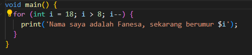
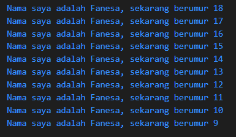

## 1. Modifikasilah kode pada baris 3 di VS Code atau Editor Code favorit Anda berikut ini agar mendapatkan keluaran (output) sesuai yang diminta!

## 2. Mengapa sangat penting untuk memahami bahasa pemrograman Dart sebelum kita menggunakan framework Flutter ? Jelaskan!

Karena Flutter sepenuhnya dibangun dari bahasa Dart, jadi untuk mengembangkan aplikasi menggunakan Flutter, kita harus memahami bahasa pemrograman Dart terlebih dahulu sebagai dasarnya.

## 3. Rangkumlah materi dari codelab ini menjadi poin-poin penting yang dapat Anda gunakan untuk membantu proses pengembangan aplikasi mobile menggunakan framework Flutter.
1.	Dart: Inti dari Flutter
o	Dart adalah bahasa utama yang digunakan untuk membangun aplikasi Flutter.
o	Bahasa ini dipilih karena memberikan pengalaman pengembangan yang modern dan optimal.
2.	Alasan Memilih Dart untuk Flutter
o	Dart menggabungkan keunggulan bahasa tingkat tinggi dengan fitur-fitur terbaru.
o	Dart bisa dikompilasi menjadi kode native untuk berbagai platform, sehingga aplikasi dapat berjalan cepat dan responsif.
o	Dart dilengkapi alat-alat pengembangan yang produktif dan sistem manajemen memori (garbage collection) yang efisien.
3.	Perkembangan Dart
o	Dart pertama kali diluncurkan pada tahun 2011 dengan fokus utama pada pengembangan aplikasi web.
o	Seiring waktu, Dart beralih fokus ke pengembangan aplikasi mobile, terutama melalui integrasinya dengan Flutter.
o	Kini, Dart telah berkembang menjadi bahasa yang mendukung proyek berskala besar dengan performa tinggi dan alat pengembangan yang kuat.
4.	Cara Menjalankan Kode Dart
o	Kode Dart dapat dijalankan melalui Dart Virtual Machine (VM) dengan mode Just-In-Time (JIT) atau Ahead-Of-Time (AOT), atau bisa juga dikompilasi menjadi JavaScript untuk aplikasi web.
o	Mode JIT memungkinkan debugging dan hot reload, sedangkan AOT menghasilkan kode native yang lebih cepat untuk berbagai platform.
5.	Struktur Dasar Dart
o	Dart adalah bahasa pemrograman berorientasi objek dengan konsep seperti enkapsulasi, pewarisan, komposisi, abstraksi, dan polimorfisme.
o	Operator di Dart digunakan sebagai metode dengan sintaks khusus, termasuk operator aritmatika, peningkatan/pengurangan nilai, kesetaraan/relasional, dan logika.
6.	Fungsi Utama dalam Dart
o	Fungsi main() adalah titik awal untuk mengeksekusi program Dart.
o	Dart VM akan mencari fungsi main() sebagai langkah awal untuk menjalankan kode, dan fungsi ini biasanya mengembalikan nilai bertipe void.
7.	Perbedaan Fungsi dan Metode
o	Fungsi: Fungsi yang berdiri sendiri, tidak terikat pada class atau objek tertentu.
o	Metode: Fungsi yang menjadi bagian dari objek atau class, dan bisa mengakses data serta properti objek tersebut melalui referensi this.
