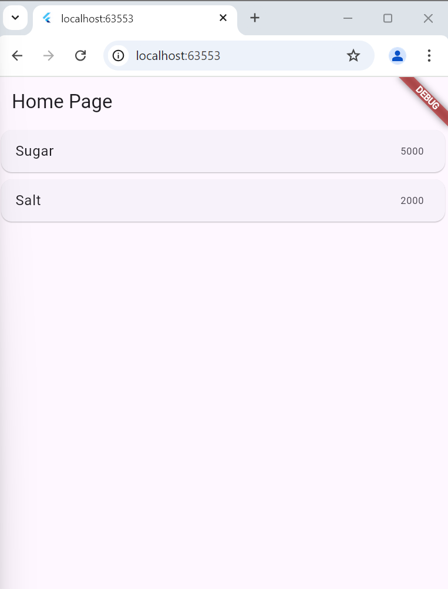
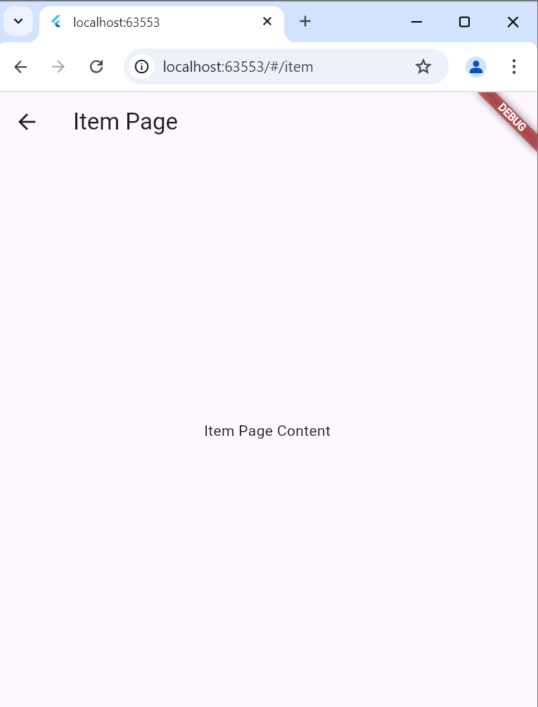
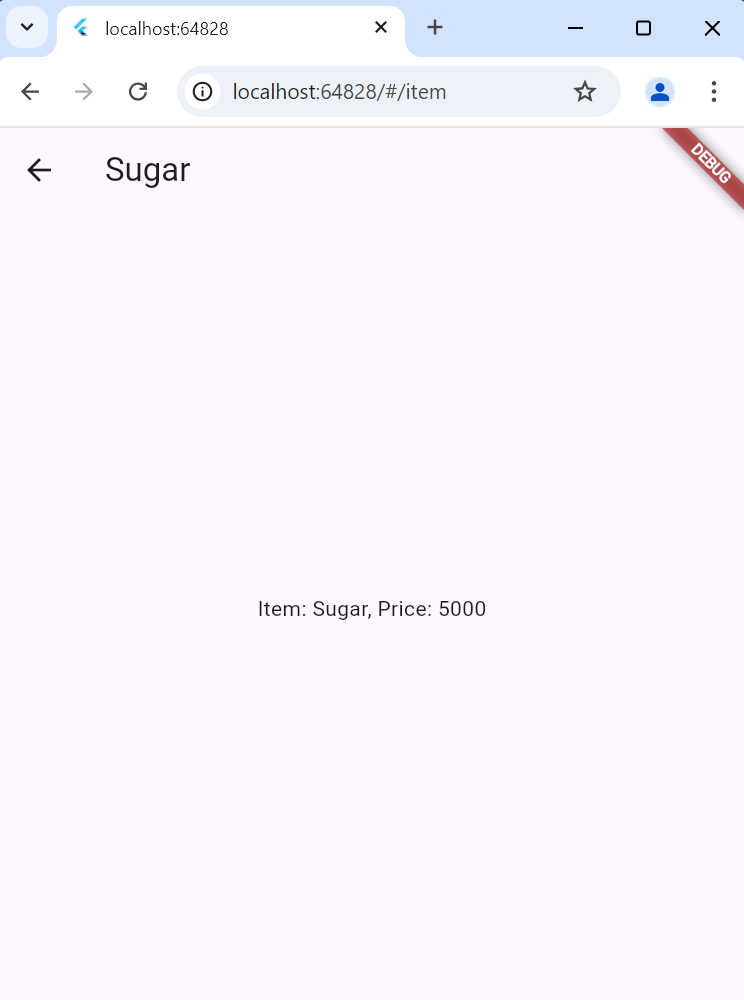
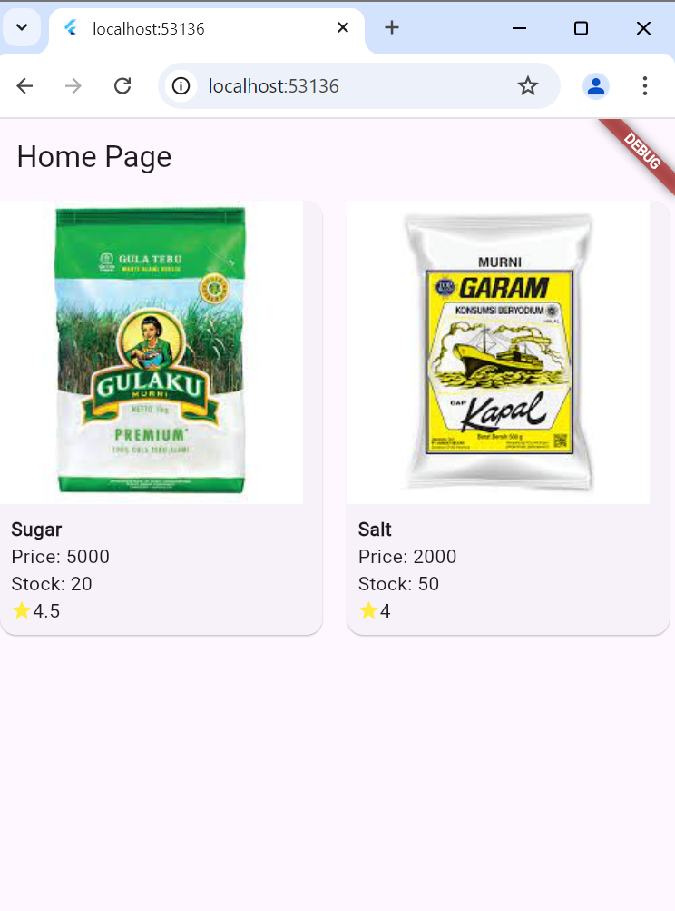
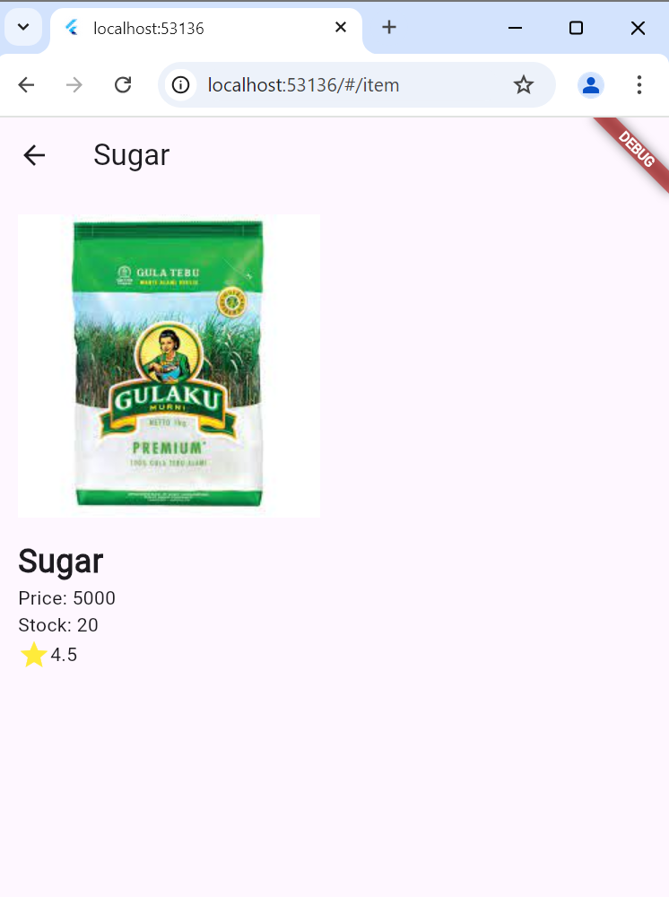
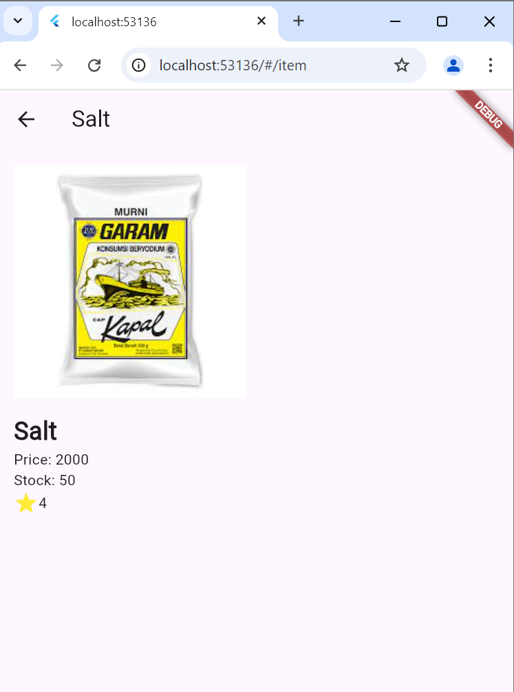
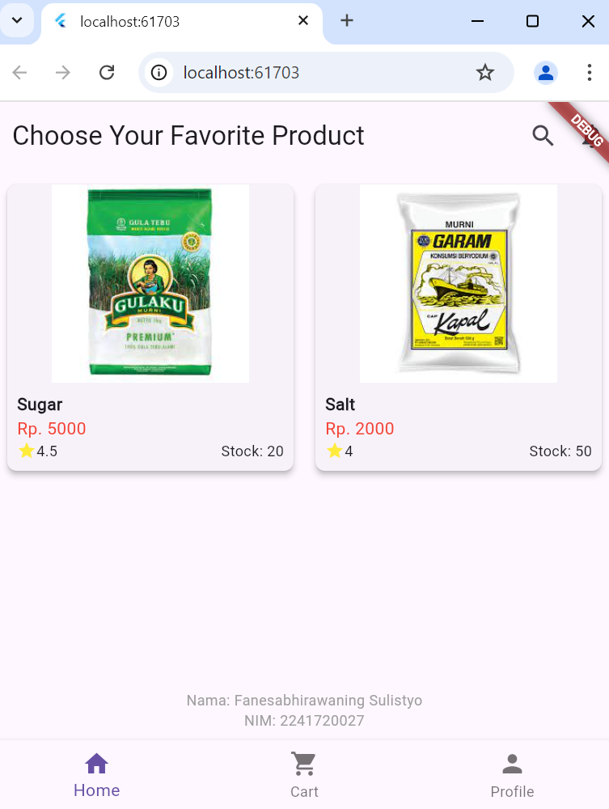
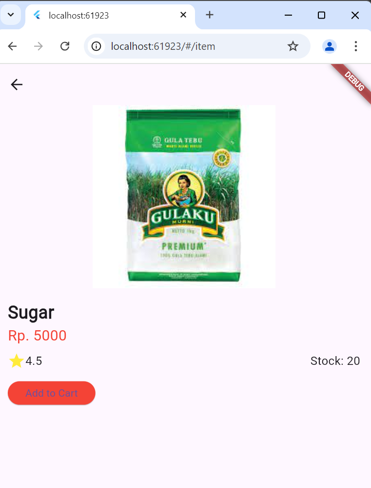
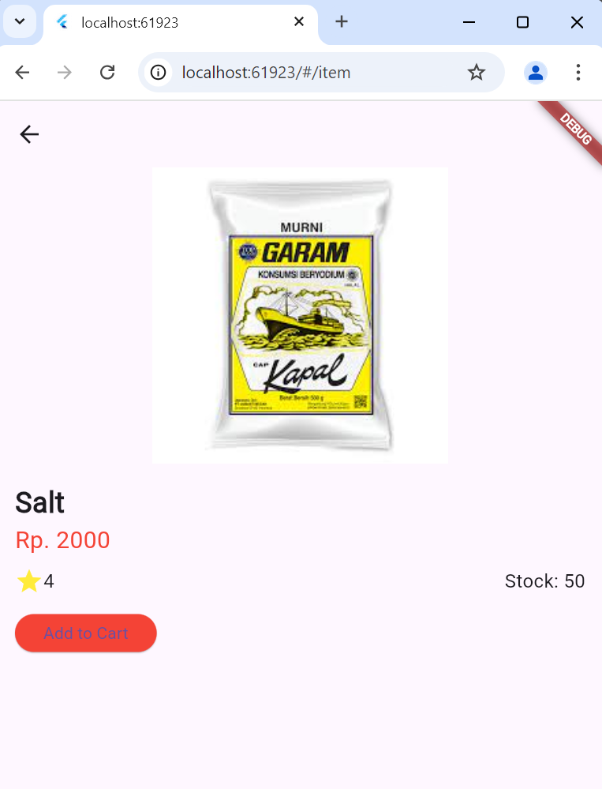

# **Laporan Praktikum**
# **Pertemuan 7**
### **Layout & Navigasi**
------


### **Data Mahasiswa**


><p>Nama : Fanesabhirawaning Sulistyo<p>
>NIM : 2241720027<p>
>Kelas : TI-3C<p>


<br>

---------
<br>

### **Praktikum 5: Membangun Navigasi di Flutter**
>Apa yang akan Anda pelajari<p>
>1. Cara kerja mekanisme navigation dan route di Flutter.
>2. Cara membuat navigation dan route di Flutter.
><p>
Selesaikan langkah-langkah praktikum berikut ini menggunakan editor Visual Studio Code (VS Code) atau Android Studio atau code editor lain kesukaan Anda. Materi ini dapat dimasukkan ke Laporan Praktikum folder Week atau Pertemuan 06.<p>
**Tampilan akhir yang akan anda buat**<p>

<p>
Pada praktikum 5 ini anda akan belajar mengenai pembangunan aplikasi bergerak multi halaman. Aplikasi yang dikembangkan berupa kasus daftar barang belanja. Pada aplikasi ini anda akan belajar untuk berpindah halaman dan mengirimkan data ke halaman lainnya. Gambaran mockup hasil akhir aplikasi dapat anda lihat pada gambar di atas (mockup dibuat sederhana, sehingga Anda mempunyai banyak ruang untuk berkreasi). Desain aplikasi menampilkan sebuah ListView widget yang datanya bersumber dari List. Ketika item ditekan, data akan dikirimkan ke halaman berikutnya.<p>

**Langkah 1: Siapkan project baru**<p>
Sebelum melanjutkan praktikum, buatlah sebuah project baru Flutter dengan nama belanja dan susunan folder seperti pada gambar berikut. Penyusunan ini dimaksudkan untuk mengorganisasi kode dan widget yang lebih mudah.<p>
<p>

 **Langkah 2: Mendefinisikan Route**<p>
 Buatlah dua buah file dart dengan nama home_page.dart dan item_page.dart pada folder pages. Untuk masing-masing file, deklarasikan class HomePage pada file home_page.dart dan ItemPage pada item_page.dart. Turunkan class dari StatelessWidget. Gambaran potongan kode dapat anda lihat sebagai berikut.<p>
 <p>

```dart
class HomePage extends StatelessWidget {
@override
Widget build(BuildContext context) {
// TODO: implement build
throw UnimplementedError();
}
}

class ItemPage extends StatelessWidget {
@override
Widget build(BuildContext context) {
// TODO: implement build
throw UnimplementedError();
}
}
```

 **Langkah 3: Lengkapi Kode di main.dart**
 Setelah kedua halaman telah dibuat dan didefinisikan, bukalah file main.dart. Pada langkah ini anda akan mendefinisikan Route untuk kedua halaman tersebut. Definisi penamaan route harus bersifat unique. Halaman HomePage didefinisikan sebagai /. Dan halaman ItemPage didefinisikan sebagai /item. Untuk mendefinisikan halaman awal, anda dapat menggunakan named argument initialRoute. Gambaran tahapan ini, dapat anda lihat pada potongan kode berikut.<p>
 <p>

```dart
void main() {
runApp(MaterialApp(
initialRoute: '/',
routes: {
'/': (context) => HomePage(),
'/item': (context) => ItemPage(),
},
)); // MaterialApp
}
```

**Langkah 4: Membuat data model**
Sebelum melakukan perpindahan halaman dari HomePage ke ItemPage, dibutuhkan proses pemodelan data. Pada desain mockup, dibutuhkan dua informasi yaitu nama dan harga. Untuk menangani hal ini, buatlah sebuah file dengan nama item.dart dan letakkan pada folder models. Pada file ini didefinisikan pemodelan data yang dibutuhkan. Ilustrasi kode yang dibutuhkan, dapat anda lihat pada potongan kode berikut.<p>


```dart
class Item {
String name;
int price;
Item({this.name, this.price});
}
```

**Langkah 5: Lengkapi kode di class HomePage**
Pada halaman HomePage terdapat ListView widget. Sumber data ListView diambil dari model List dari object Item. Gambaran kode yang dibutuhkan untuk melakukan definisi model dapat anda lihat sebagai berikut.<p>
 <p>

 ```dart
 class HomePage extends StatelessWidget {
final List<Item> items = [
Item(name: 'Sugar', price: 5000),
Item(name: 'Salt', price: 2000)
];
```

**Langkah 6: Membuat ListView dan itemBuilder**
Untuk menampilkan ListView pada praktikum ini digunakan itemBuilder. Data diambil dari definisi model yang telah dibuat sebelumnya. Untuk menunjukkan batas data satu dan berikutnya digunakan widget Card. Kode yang telah umum pada bagian ini tidak ditampilkan. Gambaran kode yang dibutuhkan dapat anda lihat sebagai berikut.<p>
<p>
Jalankan aplikasi pada emulator atau pada device anda.<p>

```dart
body: Container(  
  margin: EdgeInsets.all(8),  
  child: ListView.builder(  
    padding: EdgeInsets.all(8),  
    itemCount: items.length,  
    itemBuilder: (context, index) {  
      final item = items[index];  
      return Card(  
        child: Container(  
          margin: EdgeInsets.all(8),  
          child: Row(  
            children: [  
              Expanded(child: Text(item.name)),  
              Expanded(  
                child: Text(  
                  item.price.toString(),  
                  textAlign: TextAlign.end,  
                ), // Text  
              ), // Expanded  
            ], // Row children  
          ), // Container  
        ), // Card  
      ); // ListView.builder  
    }, // itemBuilder  
  ), // ListView.builder  
), // Container
```

>**Perhatian:** Pastikan pada halaman awal telah berhasil menampilkan ListView. Jika ada kesalahan, segera perbaiki sebelum melanjutkan ke langkah berikutnya.<p>

***Langkah 7: Menambahkan aksi pada ListView**
Item pada ListView saat ini ketika ditekan masih belum memberikan aksi tertentu. Untuk menambahkan aksi pada ListView dapat digunakan widget InkWell atau GestureDetector. Perbedaan utamanya InkWell merupakan material widget yang memberikan efek ketika ditekan. Sedangkan GestureDetector bersifat umum dan bisa juga digunakan untuk gesture lain selain sentuhan. Pada praktikum ini akan digunakan widget InkWell.<p>

Untuk menambahkan sentuhan, letakkan cursor pada widget pembuka Card. Kemudian gunakan shortcut quick fix dari VSCode (Ctrl + . pada Windows atau Cmd + . pada MacOS). Sorot menu wrap with widget... Ubah nilai widget menjadi InkWell serta tambahkan named argument onTap yang berisi fungsi untuk berpindah ke halaman ItemPage. Ilustrasi potongan kode dapat anda lihat pada potongan berikut.<p>
<p>

```dart
return InkWell(
onTap: () {
Navigator.pushNamed (context, '/item');
},
)
```

Jalankan aplikasi kembali dan pastikan ListView dapat disentuh dan berpindah ke halaman berikutnya. Periksa kembali jika terdapat kesalahan.<p>

**Hasil tampilan**
<p>
 

### **Tugas Praktikum 2**
1. Untuk melakukan pengiriman data ke halaman berikutnya, cukup menambahkan informasi arguments pada penggunaan Navigator. Perbarui kode pada bagian Navigator menjadi seperti berikut.<p>
>Navigator.pushNamed(context, '/item', arguments: item);

```dart
Navigator.pushNamed(context, '/item', arguments: item); // Kirim item sebagai arguments
```

2. Pembacaan nilai yang dikirimkan pada halaman sebelumnya dapat dilakukan menggunakan ModalRoute. Tambahkan kode berikut pada blok fungsi build dalam halaman ItemPage. Setelah nilai didapatkan, anda dapat menggunakannya seperti penggunaan variabel pada umumnya.<p>
 (https://docs.flutter.dev/cookbook/navigation/navigate-with-arguments) <p>
 >final itemArgs = ModalRoute.of(context)!.settings.arguments as Item;
 ```dart
 final itemArgs = ModalRoute.of(context)!.settings.arguments as Item;
 ```

**Hasil Output (Tampilan)**<p>
  


3. Pada hasil akhir dari aplikasi belanja yang telah anda selesaikan, tambahkan atribut foto produk, stok, dan rating. Ubahlah tampilan menjadi GridView seperti di aplikasi marketplace pada umumnya.<p>
**jawab**
Untuk menambahkan atribut seperti foto produk, stok, dan rating serta mengubah tampilan menjadi `GridView` seperti aplikasi marketplace pada umumnya, kita perlu beberapa pembaruan di kode:

1. **Tambahkan atribut baru pada model `Item`:**
   - Atribut foto (URL gambar).
   - Stok produk.
   - Rating produk.

2. **Perbarui tampilan dari `ListView` menjadi `GridView`** untuk menampilkan produk dalam bentuk kotak-kotak seperti di aplikasi marketplace.

3. **Gunakan widget untuk menampilkan gambar, stok, dan rating**.

### Langkah 1: Perbarui Model `Item`
Tambahkan atribut `imageUrl`, `stock`, dan `rating` ke model `Item`.

```dart
class Item {
  String name;
  int price;
  String imageUrl; // URL foto produk
  int stock; // Stok produk
  double rating; // Rating produk (dari 0.0 hingga 5.0)

  Item({
    required this.name,
    required this.price,
    required this.imageUrl,
    required this.stock,
    required this.rating,
  });
}
```

### Langkah 2: Perbarui Data Produk
Tambahkan data produk dengan atribut baru untuk gambar, stok, dan rating.

```dart
  final List<Item> items = [
  Item(
    name: 'Sugar',
    price: 5000,
    imageUrl: 'https://encrypted-tbn0.gstatic.com/images?q=tbn:ANd9GcTIsocjOR3DbpK_gtYbFoHTZ_IkFhUvFOxPDSufQydZMSylgv9I-On43ljdk8XfFEJuMtE&usqp=CAU',
    stock: 20,
    rating: 4.5,
  ),
  Item(
    name: 'Salt',
    price: 2000,
    imageUrl: 'https://encrypted-tbn0.gstatic.com/images?q=tbn:ANd9GcQLCFe3k1T35W-bhRF9j-3V1matg9RbTazwa9UfJJuILvEwJ4UZowcksFSOk1U7xZc9O_g&usqp=CAU',
    stock: 50,
    rating: 4.0,
  ),
];
```

### Langkah 3: Ubah `ListView` Menjadi `GridView`
Ubah tampilan dari `ListView` menjadi `GridView.builder`. Gunakan `GridTile` untuk setiap item produk.

```dart
@override
Widget build(BuildContext context) {
  return Scaffold(
    appBar: AppBar(
      title: Text('Home Page'),
    ),
    body: GridView.builder(
      gridDelegate: const SliverGridDelegateWithFixedCrossAxisCount(
        crossAxisCount: 2, // Jumlah kolom grid
        crossAxisSpacing: 10,
        mainAxisSpacing: 10,
        childAspectRatio: 0.75, // Rasio tinggi-lebar kotak produk
      ),
      itemCount: items.length,
      itemBuilder: (context, index) {
        final item = items[index];
        return InkWell(
          onTap: () {
            Navigator.pushNamed(context, '/item', arguments: item);
          },
          child: Card(
            child: Column(
              crossAxisAlignment: CrossAxisAlignment.start,
              children: [
                Expanded(
                  child: Image.network(item.imageUrl, fit: BoxFit.cover), // Tampilkan gambar produk
                ),
                Padding(
                  padding: const EdgeInsets.all(8.0),
                  child: Column(
                    crossAxisAlignment: CrossAxisAlignment.start,
                    children: [
                      Text(item.name, style: TextStyle(fontWeight: FontWeight.bold)),
                      Text('Price: ${item.price}'),
                      Text('Stock: ${item.stock}'),
                      Row(
                        children: [
                          Icon(Icons.star, color: Colors.yellow, size: 16),
                          Text('${item.rating}'),
                        ],
                      ),
                    ],
                  ),
                ),
              ],
            ),
          ),
        );
      },
    ),
  );
}
```

### Langkah 4: Perbarui `ItemPage` untuk Menampilkan Atribut Baru
Tampilkan semua atribut produk yang dikirim saat pindah ke halaman `ItemPage`.

```dart
class ItemPage extends StatelessWidget {
  @override
  Widget build(BuildContext context) {
    final itemArgs = ModalRoute.of(context)!.settings.arguments as Item;

    return Scaffold(
      appBar: AppBar(
        title: Text(itemArgs.name),
      ),
      body: Padding(
        padding: const EdgeInsets.all(16.0),
        child: Column(
          crossAxisAlignment: CrossAxisAlignment.start,
          children: [
            Image.network(itemArgs.imageUrl), // Tampilkan gambar produk
            SizedBox(height: 16),
            Text(
              itemArgs.name,
              style: TextStyle(fontSize: 24, fontWeight: FontWeight.bold),
            ),
            Text('Price: ${itemArgs.price}'),
            Text('Stock: ${itemArgs.stock}'),
            Row(
              children: [
                Icon(Icons.star, color: Colors.yellow),
                Text('${itemArgs.rating}'),
              ],
            ),
          ],
        ),
      ),
    );
  }
}
```

### Penjelasan Kode:
- **GridView**: Menggunakan `GridView.builder` untuk menampilkan produk dalam bentuk kotak-kotak seperti di aplikasi marketplace. Kita atur 2 kolom (`crossAxisCount: 2`), serta menambahkan `mainAxisSpacing` dan `crossAxisSpacing` untuk memberi jarak antar item.
- **Image.network**: Digunakan untuk menampilkan gambar dari URL.
- **Card**: Membungkus tiap item dengan `Card` agar terlihat lebih rapi.
- **Rating**: Ditampilkan menggunakan `Icon` bintang dan `Text` rating.
- **Stock dan Harga**: Ditampilkan di dalam widget `Text`.

### Tampilan Akhir
&nbsp;&nbsp;&nbsp;&nbsp;&nbsp;&nbsp;

4. Silakan implementasikan Hero widget pada aplikasi belanja Anda dengan mempelajari dari sumber ini:<p>
 https://docs.flutter.dev/cookbook/navigation/hero-animations<p>
 **jawab**
 Untuk mengimplementasikan animasi `Hero` widget di aplikasi belanja, kita akan menggunakan animasi transisi halus pada gambar produk ketika berpindah dari halaman `HomePage` ke `ItemPage`. 

Berikut adalah langkah-langkah yang diadaptasi dari [dokumentasi Hero Flutter](https://docs.flutter.dev/cookbook/navigation/hero-animations):

### Langkah 1: Menambahkan `Hero` pada `HomePage`

Kita akan menambahkan `Hero` widget di sekitar `Image.network` pada `HomePage`, dan memberikan `tag` yang unik berdasarkan produk yang di-click.

```dart
import 'package:flutter/material.dart';
import 'package:belanja/models/item.dart';

class HomePage extends StatelessWidget {
  final List<Item> items = [
    Item(
      name: 'Sugar',
      price: 5000,
      imageUrl: 'https://example.com/sugar.jpg',
      stock: 20,
      rating: 4.5,
    ),
    Item(
      name: 'Salt',
      price: 2000,
      imageUrl: 'https://example.com/salt.jpg',
      stock: 50,
      rating: 4.0,
    ),
  ];

  @override
  Widget build(BuildContext context) {
    return Scaffold(
      appBar: AppBar(
        title: Text('Home Page'),
      ),
      body: GridView.builder(
        gridDelegate: const SliverGridDelegateWithFixedCrossAxisCount(
          crossAxisCount: 2,
          crossAxisSpacing: 10,
          mainAxisSpacing: 10,
          childAspectRatio: 0.75,
        ),
        itemCount: items.length,
        itemBuilder: (context, index) {
          final item = items[index];
          return InkWell(
            onTap: () {
              Navigator.pushNamed(context, '/item', arguments: item);
            },
            child: Card(
              child: Column(
                crossAxisAlignment: CrossAxisAlignment.start,
                children: [
                  Expanded(
                    child: Hero(
                      tag: item.name, // Set tag Hero berdasarkan nama produk
                      child: Image.network(item.imageUrl, fit: BoxFit.cover),
                    ),
                  ),
                  Padding(
                    padding: const EdgeInsets.all(8.0),
                    child: Column(
                      crossAxisAlignment: CrossAxisAlignment.start,
                      children: [
                        Text(item.name, style: TextStyle(fontWeight: FontWeight.bold)),
                        Text('Price: ${item.price}'),
                        Text('Stock: ${item.stock}'),
                        Row(
                          children: [
                            Icon(Icons.star, color: Colors.yellow, size: 16),
                            Text('${item.rating}'),
                          ],
                        ),
                      ],
                    ),
                  ),
                ],
              ),
            ),
          );
        },
      ),
    );
  }
}
```

### Langkah 2: Menambahkan `Hero` pada `ItemPage`

Pada halaman `ItemPage`, tambahkan widget `Hero` di sekitar `Image.network` dengan `tag` yang sama seperti di halaman sebelumnya untuk membuat animasi yang halus saat transisi halaman.

```dart
import 'package:flutter/material.dart';
import 'package:belanja/models/item.dart';

class ItemPage extends StatelessWidget {
  @override
  Widget build(BuildContext context) {
    final itemArgs = ModalRoute.of(context)!.settings.arguments as Item;

    return Scaffold(
      appBar: AppBar(
        title: Text(itemArgs.name),
      ),
      body: Padding(
        padding: const EdgeInsets.all(16.0),
        child: Column(
          crossAxisAlignment: CrossAxisAlignment.start,
          children: [
            Hero(
              tag: itemArgs.name, // Pastikan tag sama dengan yang di HomePage
              child: Image.network(itemArgs.imageUrl), // Gambar produk
            ),
            SizedBox(height: 16),
            Text(
              itemArgs.name,
              style: TextStyle(fontSize: 24, fontWeight: FontWeight.bold),
            ),
            Text('Price: ${itemArgs.price}'),
            Text('Stock: ${itemArgs.stock}'),
            Row(
              children: [
                Icon(Icons.star, color: Colors.yellow),
                Text('${itemArgs.rating}'),
              ],
            ),
          ],
        ),
      ),
    );
  }
}
```

### Penjelasan:
1. **`Hero` Widget**:
   - `Hero` widget digunakan untuk menciptakan efek animasi transisi yang halus antara dua halaman saat navigasi. 
   - Kita menggunakan `tag` yang unik (dalam kasus ini, kita menggunakan nama produk sebagai `tag`) untuk menghubungkan elemen pada halaman yang berbeda.
2. **Pada `HomePage`**:
   - Di sekitar gambar produk di `GridView`, kita menambahkan `Hero` widget dengan `tag` berdasarkan nama produk (`item.name`).
3. **Pada `ItemPage`**:
   - Di halaman detail produk, kita juga membungkus gambar produk dengan `Hero` widget menggunakan `tag` yang sama. Ini memungkinkan Flutter untuk menghubungkan dua elemen dan membuat animasi transisi.

### Hasil Akhir:
Sekarang, ketika kita menekan salah satu item produk di `HomePage`, gambar produk akan ditransisikan secara halus ke halaman `ItemPage`. Efek animasi ini menciptakan pengalaman pengguna yang lebih interaktif dan dinamis.

### `main.dart` (tidak ada perubahan dari sebelumnya)
```dart
import 'package:flutter/material.dart';
import 'package:belanja/pages/home_page.dart';
import 'package:belanja/pages/item_page.dart';

void main() {
  runApp(MaterialApp(
    initialRoute: '/',
    routes: {
      '/': (context) => HomePage(),
      '/item': (context) => ItemPage(),
    },
  ));
}
```

Sekarang aplikasi belanja Anda memiliki animasi transisi `Hero` yang mulus antara halaman produk dan halaman detail produk.


### Tampilan Akhir
&nbsp;&nbsp;&nbsp;&nbsp;&nbsp;&nbsp;

5. Sesuaikan dan modifikasi tampilan sehingga menjadi aplikasi yang menarik. Selain itu, pecah widget menjadi kode yang lebih kecil. Tambahkan Nama dan NIM di footer aplikasi belanja Anda.<p>
**jawab**

Berikut adalah kode lengkap dari aplikasi belanja yang telah disesuaikan dengan permintaan Anda, termasuk pemecahan widget menjadi lebih kecil, penambahan `Hero` animation, `GridView`, dan footer dengan Nama dan NIM.

### File Struktur
1. **main.dart**: Menyediakan `MaterialApp` dan rute dasar aplikasi.
2. **pages/home_page.dart**: Menampilkan halaman utama dengan `GridView`.
3. **pages/item_page.dart**: Menampilkan halaman detail produk dengan `Hero` animation.
4. **widgets/item_card.dart**: Komponen kartu produk.
5. **widgets/footer.dart**: Footer untuk Nama dan NIM.
6. **models/item.dart**: Model data untuk produk.

### Kode Lengkap

#### `main.dart`
```dart
import 'package:flutter/material.dart';
import 'pages/home_page.dart';
import 'pages/item_page.dart';

void main() {
  runApp(MaterialApp(
    debugShowCheckedModeBanner: false,
    initialRoute: '/',
    routes: {
      '/': (context) => HomePage(),
      '/item': (context) => ItemPage(),
    },
  ));
}
```

#### `models/item.dart`
```dart
class Item {
  final String name;
  final double price;
  final String imageUrl;
  final int stock;
  final double rating;

  Item({
    required this.name,
    required this.price,
    required this.imageUrl,
    required this.stock,
    required this.rating,
  });
}
```

#### `pages/home_page.dart`
```dart
import 'package:flutter/material.dart';
import '../models/item.dart';
import '../widgets/item_card.dart';
import '../widgets/footer.dart';

class HomePage extends StatelessWidget {
  final List<Item> items = [
    Item(
      name: 'Sugar',
      price: 5000,
      imageUrl: 'https://encrypted-tbn0.gstatic.com/images?q=tbn:ANd9GcTIsocjOR3DbpK_gtYbFoHTZ_IkFhUvFOxPDSufQydZMSylgv9I-On43ljdk8XfFEJuMtE&usqp=CAU',
      stock: 20,
      rating: 4.5,
    ),
    Item(
      name: 'Salt',
      price: 2000,
      imageUrl: 'https://encrypted-tbn0.gstatic.com/images?q=tbn:ANd9GcQLCFe3k1T35W-bhRF9j-3V1matg9RbTazwa9UfJJuILvEwJ4UZowcksFSOk1U7xZc9O_g&usqp=CAU',
      stock: 50,
      rating: 4.0,
    ),
  ];

  @override
  Widget build(BuildContext context) {
    return Scaffold(
      appBar: AppBar(
        title: Text('Choose Your Favorite Product'),
        actions: [
          IconButton(onPressed: () {}, icon: Icon(Icons.search)),
          IconButton(onPressed: () {}, icon: Icon(Icons.notifications)),
        ],
      ),
      body: Column(
        children: [
          Expanded(
            child: GridView.builder(
              padding: EdgeInsets.all(8),
              gridDelegate: const SliverGridDelegateWithFixedCrossAxisCount(
                crossAxisCount: 2,
                crossAxisSpacing: 10,
                mainAxisSpacing: 10,
              ),
              itemCount: items.length,
              itemBuilder: (context, index) {
                final item = items[index];
                return ItemCard(item: item);
              },
            ),
          ),
          Footer(),
        ],
      ),
      bottomNavigationBar: BottomNavigationBar(
        items: const [
          BottomNavigationBarItem(icon: Icon(Icons.home), label: 'Home'),
          BottomNavigationBarItem(icon: Icon(Icons.shopping_cart), label: 'Cart'),
          BottomNavigationBarItem(icon: Icon(Icons.person), label: 'Profile'),
        ],
      ),
    );
  }
}
```

#### `widgets/item_card.dart`
```dart
import 'package:flutter/material.dart';
import '../models/item.dart';

class ItemCard extends StatelessWidget {
  final Item item;

  ItemCard({required this.item});

  @override
  Widget build(BuildContext context) {
    return InkWell(
      onTap: () {
        Navigator.pushNamed(context, '/item', arguments: item);
      },
      child: Card(
        elevation: 4,
        shape: RoundedRectangleBorder(borderRadius: BorderRadius.circular(8)),
        child: Column(
          crossAxisAlignment: CrossAxisAlignment.stretch,
          children: [
            Expanded(
              child: Hero(
                tag: item.name,
                child: Image.network(item.imageUrl, fit: BoxFit.cover),
              ),
            ),
            Padding(
              padding: const EdgeInsets.all(8.0),
              child: Column(
                crossAxisAlignment: CrossAxisAlignment.start,
                children: [
                  Text(item.name, style: TextStyle(fontWeight: FontWeight.bold)),
                  Text('Rs. ${item.price}', style: TextStyle(color: Colors.red)),
                  Row(
                    children: [
                      Icon(Icons.star, color: Colors.yellow, size: 16),
                      Text('${item.rating}', style: TextStyle(fontSize: 12)),
                      Spacer(),
                      Text('Stock: ${item.stock}', style: TextStyle(fontSize: 12)),
                    ],
                  ),
                ],
              ),
            ),
          ],
        ),
      ),
    );
  }
}
```

#### `pages/item_page.dart`
```dart
import 'package:flutter/material.dart';
import '../models/item.dart';

class ItemPage extends StatelessWidget {
  @override
  Widget build(BuildContext context) {
    final item = ModalRoute.of(context)!.settings.arguments as Item;

    return Scaffold(
      appBar: AppBar(),
      body: Column(
        children: [
          Hero(
            tag: item.name,
            child: Image.network(item.imageUrl, fit: BoxFit.cover, height: 250),
          ),
          Padding(
            padding: const EdgeInsets.all(16.0),
            child: Column(
              crossAxisAlignment: CrossAxisAlignment.start,
              children: [
                Text(item.name, style: TextStyle(fontSize: 24, fontWeight: FontWeight.bold)),
                Text('Rs. ${item.price}', style: TextStyle(color: Colors.red, fontSize: 20)),
                SizedBox(height: 8),
                Row(
                  children: [
                    Icon(Icons.star, color: Colors.yellow),
                    Text('${item.rating}', style: TextStyle(fontSize: 16)),
                    Spacer(),
                    Text('Stock: ${item.stock}', style: TextStyle(fontSize: 16)),
                  ],
                ),
                SizedBox(height: 16),
                ElevatedButton(
                  onPressed: () {},
                  child: Text('Add to Cart'),
                  style: ElevatedButton.styleFrom(primary: Colors.red),
                ),
              ],
            ),
          ),
        ],
      ),
    );
  }
}
```

#### `widgets/footer.dart`
```dart
import 'package:flutter/material.dart';

class Footer extends StatelessWidget {
  @override
  Widget build(BuildContext context) {
    return Padding(
      padding: const EdgeInsets.all(8.0),
      child: Text(
        'Nama: Fanesabhirawaning Sulistyo\nNIM: 2241720027',
        textAlign: TextAlign.center,
        style: TextStyle(fontSize: 12, color: Colors.grey),
      ),
    );
  }
}
```

### Penjelasan Kode
1. **`main.dart`**: Mengatur rute aplikasi, dengan `HomePage` sebagai halaman utama dan `ItemPage` sebagai halaman detail produk.
2. **`HomePage`**: Menggunakan `GridView.builder` untuk menampilkan daftar produk dalam format grid. Mengimpor `ItemCard` untuk setiap kartu produk dan menambahkan `Footer` di bagian bawah halaman.
3. **`ItemCard`**: Merupakan komponen kartu produk yang menampilkan gambar, nama, harga, rating, dan stok produk. `InkWell` digunakan untuk navigasi ke halaman detail menggunakan `Hero` animation.
4. **`ItemPage`**: Halaman detail produk yang menampilkan gambar, nama, harga, rating, stok, dan tombol `Add to Cart`. `Hero` animation diterapkan pada gambar produk.
5. **`Footer`**: Komponen untuk menampilkan Nama dan NIM di bagian bawah halaman utama.
6. **`Item Model`**: Model data produk (`Item`) yang menyimpan informasi `name`, `price`, `imageUrl`, `stock`, dan `rating`.

Aplikasi ini sekarang memiliki tampilan yang lebih menarik dengan fitur `GridView`, `Hero animation`, dan struktur kode yang modular dan mudah dipahami.


### Tampilan Akhir
&nbsp;&nbsp;&nbsp;&nbsp;&nbsp;&nbsp;

6. Selesaikan Praktikum 5: Navigasi dan Rute tersebut. Cobalah modifikasi menggunakan plugin go_router, lalu dokumentasikan dan push ke repository Anda berupa screenshot setiap hasil pekerjaan beserta penjelasannya di file README.md. Kumpulkan link commit repository GitHub Anda kepada dosen yang telah disepakati!<p>

**jawab**

Berikut adalah langkah-langkah untuk memodifikasi aplikasi Anda agar menggunakan plugin **go_router** dalam Flutter:

### 1. **Menambahkan Dependency**
Pertama, pastikan Anda menambahkan plugin **go_router** ke dalam file `pubspec.yaml` Anda:

```yaml
dependencies:
  flutter:
    sdk: flutter
  go_router: ^6.0.0  # Gantilah dengan versi terbaru jika diperlukan
```

Setelah menambahkan dependency, jalankan perintah `flutter pub get` untuk menginstalnya.

### 2. **Membuat Router**
Buatlah router dengan menggunakan **GoRouter**. Di bawah ini adalah contoh cara mendefinisikan rute aplikasi Anda dengan go_router:

```dart
import 'package:flutter/material.dart';
import 'package:go_router/go_router.dart';
import 'pages/home_page.dart';
import 'pages/item_page.dart';

void main() {
  runApp(MyApp());
}

class MyApp extends StatelessWidget {
  @override
  Widget build(BuildContext context) {
    final GoRouter _router = GoRouter(
      routes: <RouteBase>[
        GoRoute(
          path: '/',
          builder: (BuildContext context, GoRouterState state) {
            return HomePage();
          },
        ),
        GoRoute(
          path: '/item',
          builder: (BuildContext context, GoRouterState state) {
            final item = state.extra as Item; // Ambil item dari arguments
            return ItemPage(item: item); // Kirim item ke ItemPage
          },
        ),
      ],
    );

    return MaterialApp.router(
      routerDelegate: _router.routerDelegate,
      routeInformationParser: _router.routeInformationParser,
    );
  }
}
```

### 3. **Mengupdate Halaman Item**
Update halaman **ItemPage** agar menerima parameter `Item` dalam konstruktor:

```dart
import 'package:flutter/material.dart';
import '../models/item.dart';

class ItemPage extends StatelessWidget {
  final Item item;

  ItemPage({Key? key, required this.item}) : super(key: key);

  @override
  Widget build(BuildContext context) {
    return Scaffold(
      appBar: AppBar(title: Text(item.name)),
      body: Column(
        children: [
          Hero(
            tag: item.name,
            child: Image.network(item.imageUrl, fit: BoxFit.cover, height: 250),
          ),
          Padding(
            padding: const EdgeInsets.all(16.0),
            child: Column(
              crossAxisAlignment: CrossAxisAlignment.start,
              children: [
                Text(item.name, style: TextStyle(fontSize: 24, fontWeight: FontWeight.bold)),
                Text('Rp. ${item.price}', style: TextStyle(color: Colors.red, fontSize: 20)),
                SizedBox(height: 8),
                Row(
                  children: [
                    Icon(Icons.star, color: Colors.yellow),
                    Text('${item.rating}', style: TextStyle(fontSize: 16)),
                    Spacer(),
                    Text('Stock: ${item.stock}', style: TextStyle(fontSize: 16)),
                  ],
                ),
                SizedBox(height: 16),
                ElevatedButton(
                  onPressed: () {},
                  child: Text('Add to Cart'),
                  style: ElevatedButton.styleFrom(backgroundColor: Colors.red),
                ),
              ],
            ),
          ),
        ],
      ),
    );
  }
}
```

### 4. **Mengupdate Halaman Utama**
Terakhir, update halaman **HomePage** untuk menggunakan **GoRouter** saat navigasi:

```dart
import 'package:flutter/material.dart';
import 'package:belanja/models/item.dart';
import 'package:belanja/widget/item_card.dart';
import 'package:belanja/widget/footer.dart';

class HomePage extends StatelessWidget {
  final List<Item> items = [
    // Daftar item seperti sebelumnya...
  ];

  @override
  Widget build(BuildContext context) {
    return Scaffold(
      appBar: AppBar(
        title: Text('Choose Your Favorite Product'),
        actions: [
          IconButton(onPressed: () {}, icon: Icon(Icons.search)),
          IconButton(onPressed: () {}, icon: Icon(Icons.notifications)),
        ],
      ),
      body: Column(
        children: [
          Expanded(
            child: GridView.builder(
              padding: EdgeInsets.all(8),
              gridDelegate: const SliverGridDelegateWithFixedCrossAxisCount(
                crossAxisCount: 2,
                crossAxisSpacing: 10,
                mainAxisSpacing: 10,
              ),
              itemCount: items.length,
              itemBuilder: (context, index) {
                final item = items[index];
                return ItemCard(item: item);
              },
            ),
          ),
          Footer(),
        ],
      ),
      bottomNavigationBar: BottomNavigationBar(
        items: const [
          BottomNavigationBarItem(icon: Icon(Icons.home), label: 'Home'),
          BottomNavigationBarItem(icon: Icon(Icons.shopping_cart), label: 'Cart'),
          BottomNavigationBarItem(icon: Icon(Icons.person), label: 'Profile'),
        ],
      ),
    );
  }
}
```
### Tampilan Akhir
&nbsp;&nbsp;&nbsp;&nbsp;&nbsp;&nbsp;